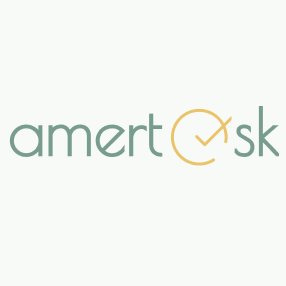
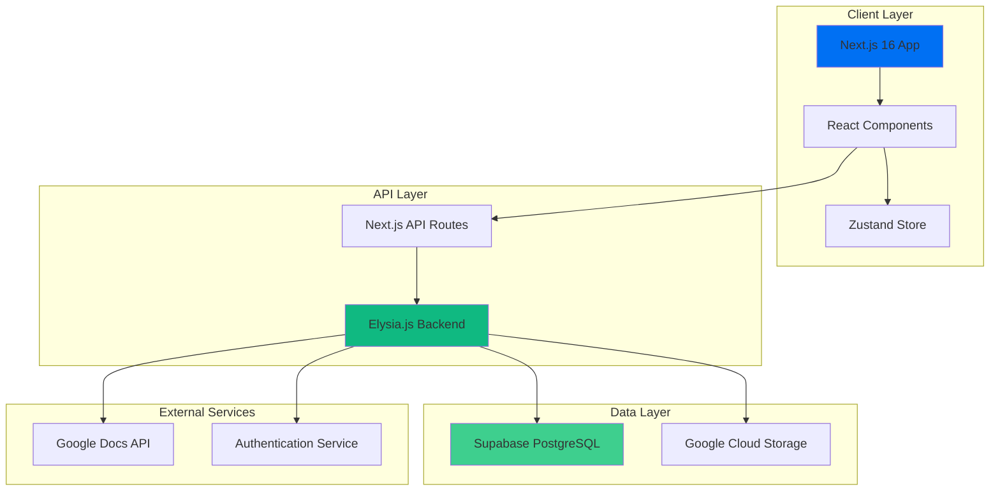
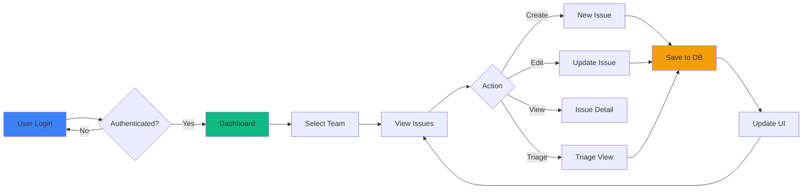
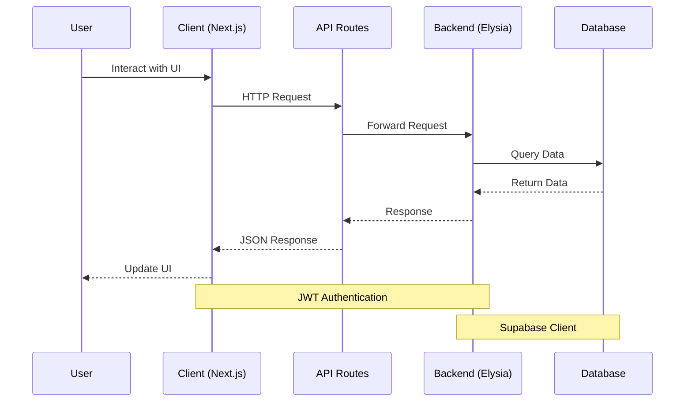

<div align="center">



# Amertaask

### Platform Manajemen Proyek Modern untuk Tim yang Produktif

[](./LICENSE)
[](https://nodejs.org)
[](https://www.typescriptlang.org/)
[](https://nextjs.org/)

**Dikembangkan oleh Tim Amertarva - PT Amerta Learning**

[Instagram](https://www.instagram.com/amertarva/) • [Dokumentasi](#-dokumentasi) • [Fitur](#-fitur-unggulan)

</div>

---

## 🎯 Tentang Amertaask

Amertaask adalah solusi manajemen proyek premium yang dirancang khusus untuk tim Indonesia. Menggabungkan kesederhanaan Linear, kekuatan Jira, dan fleksibilitas modern project management tools dalam satu platform yang intuitif dan powerful.

### 🌟 Mengapa Amertaask?

- ⚡ **Cepat & Responsif** - Dibangun dengan teknologi terkini untuk performa maksimal
- 🎨 **Desain Modern** - Interface yang indah dan mudah digunakan
- 🇮🇩 **Bahasa Indonesia** - Sepenuhnya dalam bahasa Indonesia
- 🔒 **Aman & Terpercaya** - Enterprise-grade security
- 📊 **Analytics Mendalam** - Insight untuk meningkatkan produktivitas tim
- 🔄 **Real-time Collaboration** - Kolaborasi tim secara real-time

---

## 🚀 Fitur Unggulan

### 🎯 Manajemen Proyek Lengkap

#### 📋 Issue Management

- CRUD lengkap untuk issues/tasks dengan numbering otomatis
- Status tracking: Backlog, Todo, In Progress, In Review, Done, Cancelled, Bug
- Priority levels: Urgent, High, Medium, Low
- Label system untuk kategorisasi
- Assignment ke team members
- Parent-child issue relationships
- Rich text description dengan markdown support
- Issue filtering, sorting, dan search

#### 🗂️ Three-Phase Workflow

**1. Planning Phase**

- Perencanaan task dengan expected output
- Assignment dan prioritization
- Status tracking dari planning hingga execution
- Export planning ke Google Docs

**2. Backlog Management**

- Product Backlog untuk fitur-fitur baru
- Priority Backlog untuk urgent/high priority items
- Target user specification
- Reason tracking untuk prioritas tinggi
- Export backlog ke Google Docs

**3. Execution Phase**

- Active task monitoring
- Blocked task management dengan alasan
- Progress notes dan updates
- Timeline tracking
- Export execution report ke Google Docs

#### 🔍 Triage System

- Inbox untuk issue masuk yang belum di-triage
- Accept/Decline workflow dengan reasoning
- Bulk triage operations
- Auto-assignment saat accept
- Notification system untuk triage items

### 👥 Team Collaboration

#### Team Management

- Multi-team support dengan team slugs
- Team member management
- Role-based access control
- Team invitations dengan preview
- Accept/reject invitation workflow
- Team switching interface

#### User Management

- User profiles dengan avatar dan initials
- User preferences dan settings
- Activity tracking
- Assignment history

### � Analytics & Insights

#### Team Analytics Dashboard

- Summary metrics (total, open, in progress, completed, cancelled)
- Issues by status distribution
- Issues by priority breakdown
- Issues by assignee workload
- Completion trend over time
- Date range filtering (default 30 hari)
- Visual charts dan graphs

### 📤 Export & Integration

#### Google Docs Export

- Export Planning dengan format profesional
- Export Backlog (Product + Priority)
- Export Execution Report
- Auto-formatting dengan tabel styled
- Color-coded headers dan rows
- Automatic section markers untuk update incremental
- Support untuk subsections (Product/Priority Backlog)

### � User Experience

#### �🌓 Theme System

- Light/Dark mode toggle
- Visual themes: School, Work, Default
- Color theme picker dengan 8+ pilihan warna
- Persistent theme preferences
- Smooth theme transitions

#### 📱 Responsive Design

- Mobile-first approach
- Tablet optimization
- Desktop full-featured interface
- Touch-friendly controls
- Adaptive layouts

#### 🎭 UI Components

- Modern design system dengan Tailwind CSS 4
- Custom UI components library
- Smooth animations dengan Motion (Framer Motion)
- Drag & drop interface (@dnd-kit)
- Toast notifications
- Modal dialogs
- Dropdown menus
- Tooltips
- Empty states
- Loading states
- Error handling

### � Authentication & Security

- JWT-based authentication
- Secure password hashing
- Token refresh mechanism
- Protected API routes
- Team-based access control
- Session management
- Auto-logout on token expiry

### 📬 Notification System

- Inbox untuk notifikasi personal
- Mark as read/unread
- Mark all as read
- Notification badges
- Real-time updates
- Notification filtering

### 🎯 Advanced Features

- **Search & Filter**: Powerful search dengan multiple filters
- **Sorting**: Multi-column sorting
- **Pagination**: Efficient data loading
- **Keyboard Shortcuts**: Quick actions
- **Onboarding**: New user wizard
- **Settings**: Comprehensive system settings
- **Error Boundaries**: Graceful error handling
- **Loading States**: Skeleton screens
- **Optimistic Updates**: Instant UI feedback

---

## 🏗️ Arsitektur Sistem



## 🔄 Alur Kerja Aplikasi



## 📊 Data Flow



---

## 🛠️ Tech Stack

### Frontend

- **Framework**: Next.js 16 (App Router)
- **Language**: TypeScript 5.9
- **Styling**: Tailwind CSS 4
- **UI Components**: Custom Design System
- **Animation**: Motion (Framer Motion v11+)
- **Icons**: Lucide React
- **State Management**: Zustand
- **Drag & Drop**: @dnd-kit

### Backend

- **Runtime**: Bun
- **Framework**: Elysia.js
- **Database**: Supabase (PostgreSQL)
- **Authentication**: JWT
- **Storage**: Google Cloud Storage
- **API Integration**: Google Docs API

### DevOps

- **Monorepo**: Turborepo
- **Package Manager**: Bun
- **Linting**: ESLint
- **Formatting**: Prettier

---

## 📁 Struktur Proyek

```
taskops/
├── apps/
│   ├── web/                 # Next.js Frontend
│   │   ├── src/
│   │   │   ├── app/        # App Router pages
│   │   │   ├── components/ # React components
│   │   │   ├── hooks/      # Custom hooks
│   │   │   ├── lib/        # Utilities
│   │   │   ├── store/      # Zustand stores
│   │   │   └── types/      # TypeScript types
│   │   └── public/         # Static assets
│   │
│   └── server/             # Elysia.js Backend
│       ├── src/
│       │   ├── controllers/
│       │   ├── services/
│       │   ├── middleware/
│       │   ├── routes/
│       │   └── types/
│       └── database-migration-*.sql
│
├── packages/               # Shared packages
├── LICENSE                # Proprietary license
└── README.md             # This file
```

---

## 🚀 Quick Start

### Prerequisites

- Node.js 18+ atau Bun 1.2+
- PostgreSQL (via Supabase)
- Google Cloud Account (untuk storage)

### Installation

```bash
# Clone repository
git clone <repository-url>
cd taskops

# Install dependencies
bun install

# Setup environment variables
cp apps/web/.env.local.example apps/web/.env.local
cp apps/server/.env.example apps/server/.env

# Edit .env files dengan credentials Anda

# Run database migrations
# Jalankan file SQL di apps/server/migrations/*.sql di Supabase SQL Editor
```

### Development

#### Option 1: Automatic (Recommended)

```bash
# Windows
.\start-dev.ps1

# Linux/Mac
chmod +x start-dev.sh
./start-dev.sh
```

Script ini akan:

- Install dependencies otomatis
- Start backend server (port 3000)
- Start frontend server (port 3001)
- Membuka 2 terminal terpisah untuk monitoring

#### Option 2: Manual

```bash
# Terminal 1 - Backend
cd apps/server
bun run dev
# Backend akan berjalan di http://localhost:3000

# Terminal 2 - Frontend
cd apps/web
bun run dev
# Frontend akan berjalan di http://localhost:3001
```

### Akses Aplikasi

- **Frontend**: http://localhost:3001
- **Backend API**: http://localhost:3000
- **API Docs**: http://localhost:3000/docs

### Troubleshooting

Jika mengalami error "Infinite Loop Terdeteksi", pastikan:

1. Backend berjalan di port 3000
2. Frontend berjalan di port 3001
3. File `.env.local` berisi `BACKEND_URL=http://localhost:3000`

Lihat [DEVELOPMENT_SETUP.md](./apps/web/DEVELOPMENT_SETUP.md) untuk panduan lengkap.

---

## 📚 Dokumentasi

### Quick Start

- **[Web App README](./apps/web/README.md)** - Dokumentasi frontend lengkap
- **[Server README](./apps/server/README.md)** - Dokumentasi backend lengkap

### Development Guides

- **[AGENTS.md](./apps/web/AGENTS.md)** - Panduan lengkap untuk developer
- **[ARCHITECTURE.md](./apps/web/ARCHITECTURE.md)** - Arsitektur aplikasi
- **[API Documentation](./apps/web/src/app/api/README.md)** - API endpoints

---

### Tentang Amertarva

Amertarva adalah tim pengembangan software di bawah PT Amerta Learning yang fokus pada pembuatan solusi digital berkualitas tinggi untuk pasar Indonesia.

**Follow kami**: [Instagram @amertarva](https://www.instagram.com/amertarva/)

---

## 📦 Scripts

```bash
# Development
bun dev              # Start all apps in development mode
bun dev --filter=web # Start only web app

# Build
bun build            # Build all apps for production

# Linting & Formatting
bun lint             # Run ESLint
bun format           # Format code with Prettier
bun check-types      # TypeScript type checking
```

---

## 🔒 Lisensi & Keamanan

Amertaask adalah software proprietary yang dilindungi hak cipta.

- **Copyright**: © 2026 Amertarva - PT Amerta Learning
- **License**: Proprietary Software License
- **Status**: All Rights Reserved

Lihat [LICENSE](./LICENSE) untuk detail lengkap.

### Keamanan

Untuk melaporkan kerentanan keamanan, silakan hubungi tim kami melalui:

- Email: security@amertarva.com
- Instagram: [@amertarva](https://www.instagram.com/amertarva/)

---

## 🤝 Dukungan & Kontak

### Subscription & Enterprise

Tertarik menggunakan Amertaask untuk tim atau perusahaan Anda?

- 📧 Email: sales@amertarva.com
- 📱 Instagram: [@amertarva](https://www.instagram.com/amertarva/)
- 🏢 PT Amerta Learning

### Support

Butuh bantuan? Hubungi kami:

- 📧 Email: support@amertarva.com
- 📱 Instagram: [@amertarva](https://www.instagram.com/amertarva/)

---

## 🎯 Roadmap

- [ ] Mobile App (React Native)
- [ ] Advanced Analytics Dashboard
- [ ] Time Tracking Integration
- [ ] Automation & Workflows
- [ ] API Public untuk Integrasi
- [ ] Slack/Discord Integration
- [ ] Advanced Reporting
- [ ] Custom Fields & Templates

---

<div align="center">

### Dibuat oleh Tim Amertarva

**PT Amerta Learning** • **Indonesia**

[Instagram](https://www.instagram.com/amertarva/) • [Website](#) • [Contact](#)

---

© 2026 Amertarva - PT Amerta Learning. All Rights Reserved.

</div>
