<div align="center">

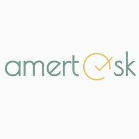

# Amertaask

### Platform Manajemen Proyek Modern untuk Tim yang Produktif

[](./LICENSE)
[](https://nodejs.org)
[](https://www.typescriptlang.org/)
[](https://nextjs.org/)

**Dikembangkan oleh Tim Amertarva - PT Amerta Learning**

[Instagram](https://www.instagram.com/amertarva/) • [Dokumentasi](#-dokumentasi) • [Fitur](#-fitur-unggulan)

</div>

---

## 🎯 Tentang Amertaask

Amertaask adalah solusi manajemen proyek premium yang dirancang khusus untuk tim Indonesia. Menggabungkan kesederhanaan Linear, kekuatan Jira, dan fleksibilitas modern project management tools dalam satu platform yang intuitif dan powerful.

### 🌟 Mengapa Amertaask?

- ⚡ **Cepat & Responsif** - Dibangun dengan teknologi terkini untuk performa maksimal
- 🎨 **Desain Modern** - Interface yang indah dan mudah digunakan
- 🇮🇩 **Bahasa Indonesia** - Sepenuhnya dalam bahasa Indonesia
- 🔒 **Aman & Terpercaya** - Enterprise-grade security
- 📊 **Analytics Mendalam** - Insight untuk meningkatkan produktivitas tim
- 🔄 **Real-time Collaboration** - Kolaborasi tim secara real-time

---

## 🚀 Fitur Unggulan

### 🎯 Manajemen Proyek Lengkap

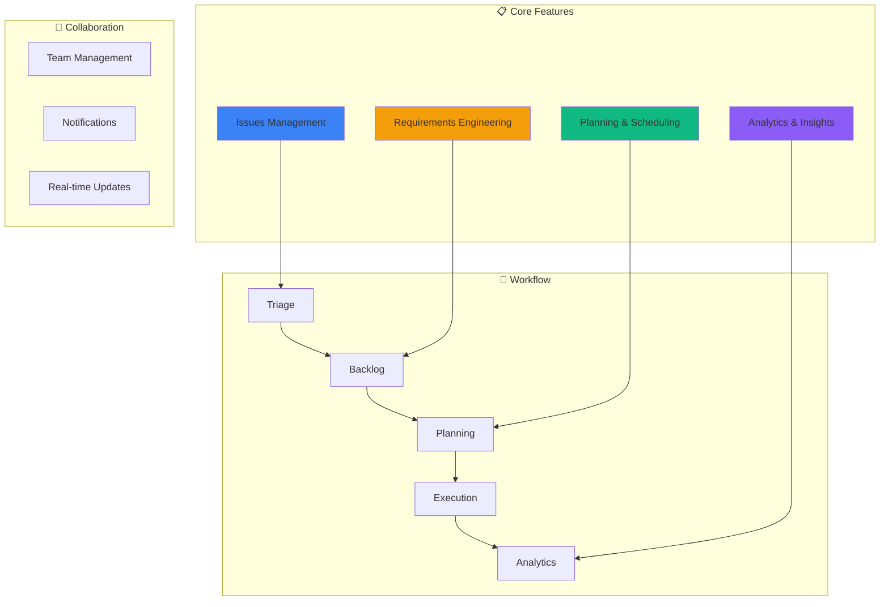
```mermaid
graph TB
    subgraph "📋 Core Features"
        A[Issues Management]
        B[Planning & Scheduling]
        C[Requirements Engineering]
        D[Analytics & Insights]
    end

    subgraph "🔄 Workflow"
        E[Triage] --> F[Backlog]
        F --> G[Planning]
        G --> H[Execution]
        H --> I[Analytics]
    end

    subgraph "🤝 Collaboration"
        J[Team Management]
        K[Notifications]
        L[Real-time Updates]
    end

    A --> E
    B --> G
    C --> F
    D --> I

    style A fill:#3b82f6
    style B fill:#10b981
    style C fill:#f59e0b
    style D fill:#8b5cf6
```

#### 📋 Issue Management

- **CRUD Lengkap** dengan numbering otomatis (TEAM-001, TEAM-002, dst)
- **Status Tracking**: Backlog, Todo, In Progress, In Review, Done, Cancelled, Bug
- **Priority Levels**: Urgent, High, Medium, Low dengan color coding
- **Label System** untuk kategorisasi fleksibel
- **Assignment** ke team members dengan workload tracking
- **Parent-Child Relationships** untuk task breakdown
- **Rich Text Editor** dengan markdown support
- **Advanced Filtering** berdasarkan status, priority, assignee, labels
- **Smart Search** dengan fuzzy matching
- **Bulk Operations** untuk efisiensi maksimal

#### 📊 Requirements Engineering (NEW!)

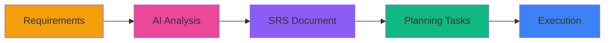
```mermaid
flowchart LR
    A[Requirements] --> B[AI Analysis]
    B --> C[SRS Document]
    C --> D[Planning Tasks]
    D --> E[Execution]

    style A fill:#f59e0b
    style B fill:#ec4899
    style C fill:#8b5cf6
    style D fill:#10b981
    style E fill:#3b82f6
```

- **Requirements Dashboard** untuk mengelola kebutuhan proyek
- **AI-Powered Analysis** dengan Google Gemini untuk generate requirements
- **SRS (Software Requirements Specification)** otomatis
- **Functional & Non-Functional Requirements** terstruktur
- **Requirements Traceability** ke planning dan issues
- **Export ke Google Docs** dengan format IEEE 830
- **Version Control** untuk requirements changes
- **Stakeholder Management** dan approval workflow

#### 🗂️ Three-Phase Workflow

**1. Planning Phase**

- **Sprint Planning** dengan drag & drop interface
- **Task Breakdown** dengan expected output
- **Effort Estimation** dan capacity planning
- **Dependency Management** antar tasks
- **Gantt Chart Visualization** untuk timeline
- **Critical Path Analysis** otomatis
- **Resource Allocation** dan workload balancing
- **Export Planning** ke Google Docs

**2. Backlog Management**

- **Product Backlog** untuk fitur-fitur baru
- **Priority Backlog** untuk urgent/high priority items
- **User Story Mapping** dengan target user
- **Reason Tracking** untuk prioritas tinggi
- **Backlog Grooming** tools
- **Story Points** dan estimation
- **Epic Management** untuk large features
- **Export Backlog** ke Google Docs

**3. Execution Phase**

- **Active Task Monitoring** real-time
- **Blocked Task Management** dengan alasan dan resolution
- **Progress Notes** dan daily updates
- **Timeline Tracking** dengan milestone
- **Burndown Charts** untuk sprint progress
- **Velocity Tracking** tim
- **Daily Standup** support
- **Export Execution Report** ke Google Docs

#### 🔍 Triage System

- **Smart Inbox** untuk issue masuk yang belum di-triage
- **Accept/Decline Workflow** dengan reasoning
- **Bulk Triage Operations** untuk efisiensi
- **Auto-Assignment** saat accept dengan load balancing
- **Priority Scoring** otomatis berdasarkan kriteria
- **Notification System** untuk triage items
- **SLA Tracking** untuk response time
- **Triage Analytics** untuk improvement

### 👥 Team Collaboration

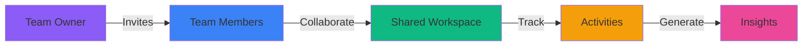
```mermaid
graph LR
    A[Team Owner] -->|Invites| B[Team Members]
    B -->|Collaborate| C[Shared Workspace]
    C -->|Track| D[Activities]
    D -->|Generate| E[Insights]

    style A fill:#8b5cf6
    style B fill:#3b82f6
    style C fill:#10b981
    style D fill:#f59e0b
    style E fill:#ec4899
```

#### Team Management

- **Multi-Team Support** dengan team slugs dan workspace isolation
- **Team Member Management** dengan role-based permissions
- **Role-Based Access Control** (Owner, Admin, Member, Viewer)
- **Team Invitations** dengan email preview dan custom message
- **Accept/Reject Workflow** dengan notification
- **Team Switching** interface yang smooth
- **Team Settings** dan customization
- **Team Activity Log** untuk audit trail

#### User Management

- **User Profiles** dengan avatar, initials, dan bio
- **User Preferences** dan personalization
- **Activity Tracking** dan contribution history
- **Assignment History** dan workload analytics
- **Notification Preferences** per user
- **Timezone Support** untuk distributed teams
- **User Status** (Active, Away, Busy)

### 📊 Analytics & Insights

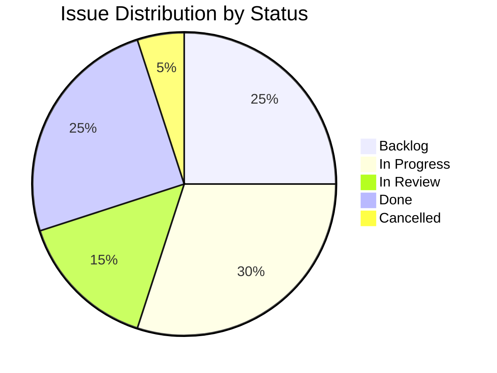
```mermaid
pie title Issue Distribution by Status
    "Backlog" : 25
    "In Progress" : 30
    "In Review" : 15
    "Done" : 25
    "Cancelled" : 5
```

#### Team Analytics Dashboard

- **Summary Metrics** (total, open, in progress, completed, cancelled)
- **Issues by Status** distribution dengan visual charts
- **Issues by Priority** breakdown dan trends
- **Issues by Assignee** workload dan capacity
- **Completion Trend** over time dengan forecasting
- **Velocity Tracking** untuk sprint planning
- **Burndown Charts** untuk sprint progress
- **Cycle Time Analysis** untuk process improvement
- **Date Range Filtering** (7, 30, 90 hari, custom)
- **Export Analytics** ke PDF/Excel
- **Custom Dashboards** per team
- **Real-time Updates** untuk live monitoring

### 📤 Export & Integration

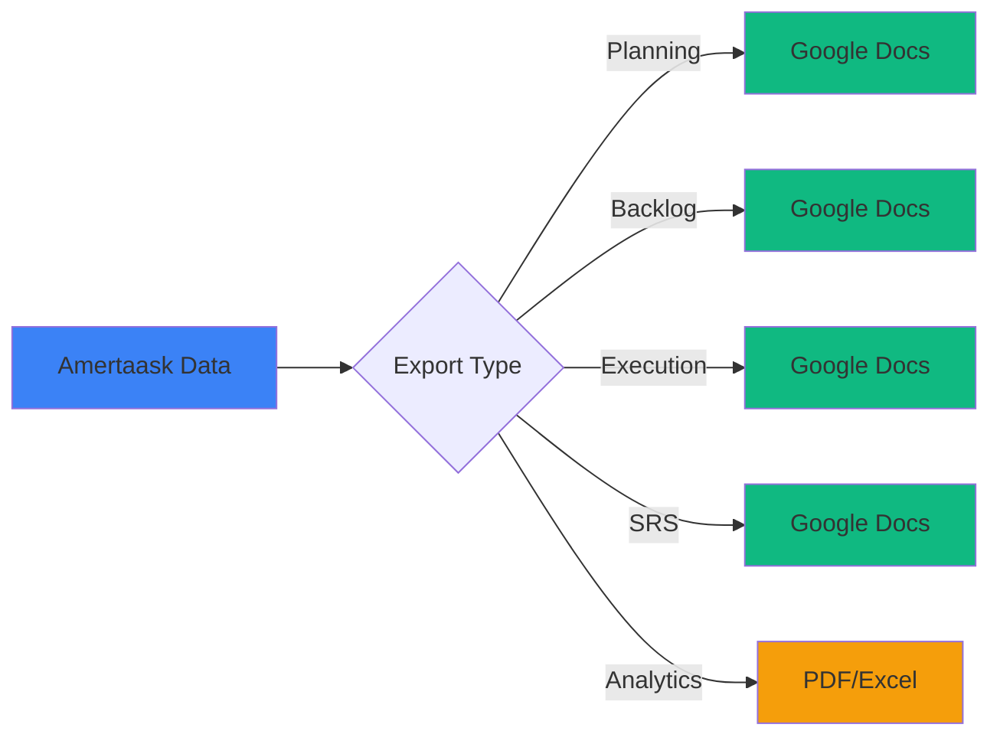
```mermaid
flowchart LR
    A[Amertaask Data] --> B{Export Type}
    B -->|Planning| C[Google Docs]
    B -->|Backlog| D[Google Docs]
    B -->|Execution| E[Google Docs]
    B -->|SRS| F[Google Docs]
    B -->|Analytics| G[PDF/Excel]

    style A fill:#3b82f6
    style C fill:#10b981
    style D fill:#10b981
    style E fill:#10b981
    style F fill:#10b981
    style G fill:#f59e0b
```

#### Google Docs Export

- **Export Planning** dengan format profesional dan timeline
- **Export Backlog** (Product + Priority) dengan prioritization matrix
- **Export Execution Report** dengan progress tracking
- **Export SRS** dengan format IEEE 830 standard
- **Export Requirements** dengan traceability matrix
- **Auto-Formatting** dengan tabel styled dan color-coded
- **Color-Coded Headers** dan rows untuk readability
- **Automatic Section Markers** untuk update incremental
- **Support Subsections** (Product/Priority Backlog, Functional/Non-Functional)
- **Version Control** untuk document history
- **Collaborative Editing** dengan Google Docs sharing

#### API Integration (Coming Soon)

- **REST API** untuk third-party integration
- **Webhooks** untuk real-time events
- **Slack Integration** untuk notifications
- **Jira Import/Export** untuk migration
- **GitHub Integration** untuk code linking
- **Custom Integrations** dengan API keys

### 🎨 User Experience


```mermaid
graph TB
    subgraph "🎨 Visual Themes"
        A[Default Theme]
        B[School Theme]
        C[Work Theme]
    end

    subgraph "🌓 Color Modes"
        D[Light Mode]
        E[Dark Mode]
    end

    subgraph "🎨 Color Schemes"
        F[8+ Color Options]
    end

    A --> D
    A --> E
    B --> D
    B --> E
    C --> D
    C --> E

    D --> F
    E --> F

    style A fill:#3b82f6
    style B fill:#10b981
    style C fill:#8b5cf6
    style D fill:#fbbf24
    style E fill:#1f2937
    style F fill:#ec4899
```

#### 🌓 Theme System

- **Light/Dark Mode** toggle dengan smooth transition
- **Visual Themes**: School, Work, Default dengan personality berbeda
- **Color Theme Picker** dengan 8+ pilihan warna (Blue, Green, Purple, Pink, Orange, Red, Teal, Indigo)
- **Persistent Preferences** tersimpan per user
- **Smooth Transitions** tanpa flicker
- **System Theme Detection** untuk auto dark mode
- **Custom Theme Builder** (coming soon)

#### 📱 Responsive Design

- **Mobile-First Approach** untuk pengalaman optimal di semua device
- **Tablet Optimization** dengan layout adaptif
- **Desktop Full-Featured** interface dengan multi-panel
- **Touch-Friendly Controls** untuk mobile dan tablet
- **Adaptive Layouts** yang menyesuaikan screen size
- **Progressive Web App** (PWA) support
- **Offline Mode** untuk basic operations

#### 🎭 UI Components

- **Modern Design System** dengan Tailwind CSS 4
- **Custom Component Library** yang reusable dan consistent
- **Smooth Animations** dengan Motion (Framer Motion)
- **Drag & Drop Interface** (@dnd-kit) untuk planning dan kanban
- **Toast Notifications** untuk feedback instant
- **Modal Dialogs** dengan backdrop blur
- **Dropdown Menus** dengan keyboard navigation
- **Tooltips** untuk helpful hints
- **Empty States** dengan actionable suggestions
- **Loading States** dengan skeleton screens
- **Error Handling** yang user-friendly
- **Accessibility** (WCAG 2.1 AA compliant)

### 🔐 Authentication & Security

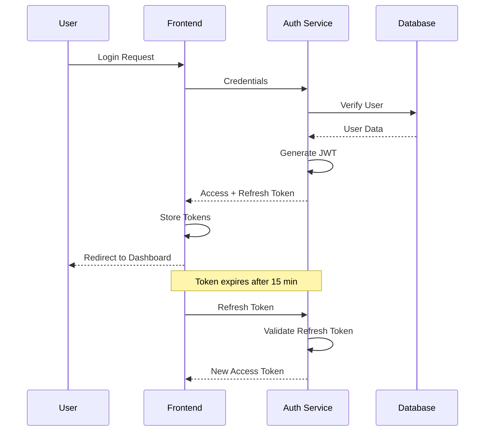
```mermaid
sequenceDiagram
    participant U as User
    participant F as Frontend
    participant A as Auth Service
    participant D as Database

    U->>F: Login Request
    F->>A: Credentials
    A->>D: Verify User
    D-->>A: User Data
    A->>A: Generate JWT
    A-->>F: Access + Refresh Token
    F->>F: Store Tokens
    F-->>U: Redirect to Dashboard

    Note over F,A: Token expires after 15 min

    F->>A: Refresh Token
    A->>A: Validate Refresh Token
    A-->>F: New Access Token
```

- **JWT-Based Authentication** dengan secure token generation
- **Secure Password Hashing** menggunakan bcrypt
- **Token Refresh Mechanism** otomatis untuk seamless experience
- **Protected API Routes** dengan middleware authentication
- **Team-Based Access Control** untuk data isolation
- **Session Management** dengan automatic cleanup
- **Auto-Logout** on token expiry untuk security
- **Password Reset** via email (coming soon)
- **Two-Factor Authentication** (2FA) (coming soon)
- **OAuth Integration** (Google, GitHub) (coming soon)
- **Audit Logging** untuk security monitoring
- **Rate Limiting** untuk prevent brute force attacks

### 📬 Notification System

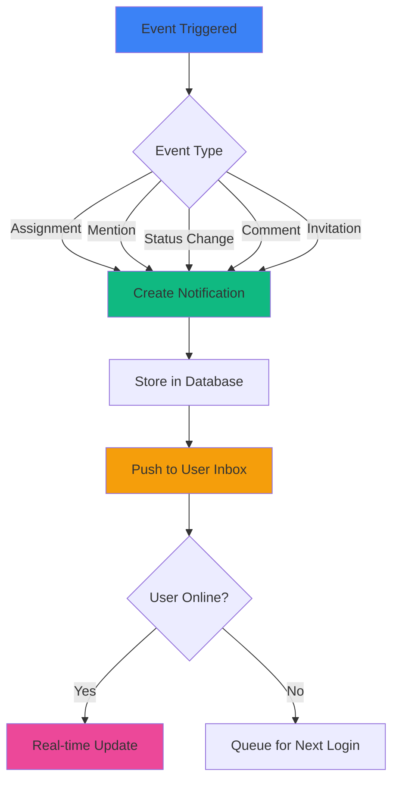
```mermaid
flowchart TD
    A[Event Triggered] --> B{Event Type}
    B -->|Assignment| C[Create Notification]
    B -->|Mention| C
    B -->|Status Change| C
    B -->|Comment| C
    B -->|Invitation| C

    C --> D[Store in Database]
    D --> E[Push to User Inbox]
    E --> F{User Online?}
    F -->|Yes| G[Real-time Update]
    F -->|No| H[Queue for Next Login]

    style A fill:#3b82f6
    style C fill:#10b981
    style E fill:#f59e0b
    style G fill:#ec4899
```

- **Personal Inbox** untuk notifikasi terpusat
- **Mark as Read/Unread** untuk tracking
- **Mark All as Read** untuk bulk action
- **Notification Badges** dengan unread count
- **Real-Time Updates** tanpa refresh
- **Notification Filtering** berdasarkan type
- **Notification Preferences** per user
- **Email Notifications** (coming soon)
- **Push Notifications** untuk mobile (coming soon)
- **Notification History** dengan search
- **Smart Grouping** untuk related notifications
- **Snooze Notifications** untuk later action

### 🎯 Advanced Features

#### 🔍 Search & Filter

- **Global Search** across all issues, tasks, dan requirements
- **Advanced Filters** dengan multiple criteria
- **Saved Filters** untuk quick access
- **Filter Presets** (My Issues, Urgent, Blocked, dll)
- **Fuzzy Search** untuk typo tolerance
- **Search History** untuk repeated searches

#### 📊 Sorting & Pagination

- **Multi-Column Sorting** dengan priority order
- **Efficient Pagination** dengan infinite scroll option
- **Customizable Page Size** (10, 25, 50, 100)
- **Jump to Page** untuk quick navigation
- **Total Count** dan result summary

#### ⌨️ Keyboard Shortcuts

- **Quick Actions** dengan keyboard shortcuts
- **Navigation Shortcuts** untuk faster workflow
- **Command Palette** (Cmd/Ctrl + K) untuk search commands
- **Customizable Shortcuts** per user preference
- **Shortcut Cheatsheet** dengan help modal

#### 🎓 Onboarding & Help

- **New User Wizard** untuk first-time setup
- **Interactive Tutorials** untuk key features
- **Contextual Help** dengan tooltips
- **Video Guides** untuk complex workflows
- **Knowledge Base** dengan searchable articles
- **In-App Chat Support** (coming soon)

#### ⚙️ Settings & Customization

- **System Settings** untuk global configuration
- **Team Settings** untuk team-specific preferences
- **User Preferences** untuk personalization
- **Integration Settings** untuk third-party apps
- **Notification Settings** untuk control alerts
- **Privacy Settings** untuk data control
- **Export/Import Settings** untuk backup

#### 🛡️ Error Handling & Reliability

- **Error Boundaries** untuk graceful degradation
- **Loading States** dengan skeleton screens
- **Optimistic Updates** untuk instant UI feedback
- **Retry Mechanisms** untuk failed requests
- **Offline Detection** dengan queue sync
- **Error Reporting** untuk bug tracking
- **Health Monitoring** untuk system status

#### 🎨 Visualization & Graphs

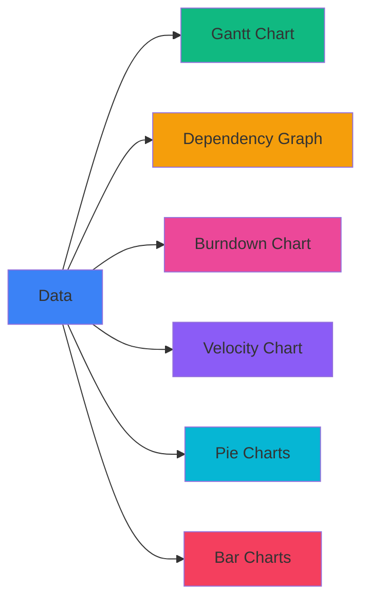
```mermaid
graph LR
    A[Data] --> B[Gantt Chart]
    A --> C[Dependency Graph]
    A --> D[Burndown Chart]
    A --> E[Velocity Chart]
    A --> F[Pie Charts]
    A --> G[Bar Charts]

    style A fill:#3b82f6
    style B fill:#10b981
    style C fill:#f59e0b
    style D fill:#ec4899
    style E fill:#8b5cf6
    style F fill:#06b6d4
    style G fill:#f43f5e
```

- **Gantt Chart** untuk timeline visualization
- **Dependency Graph** untuk task relationships
- **Burndown Charts** untuk sprint tracking
- **Velocity Charts** untuk team performance
- **Distribution Charts** untuk analytics
- **Custom Dashboards** dengan drag & drop widgets
- **Export Charts** ke PNG/SVG

---

## 🏗️ Arsitektur Sistem

### High-Level Architecture

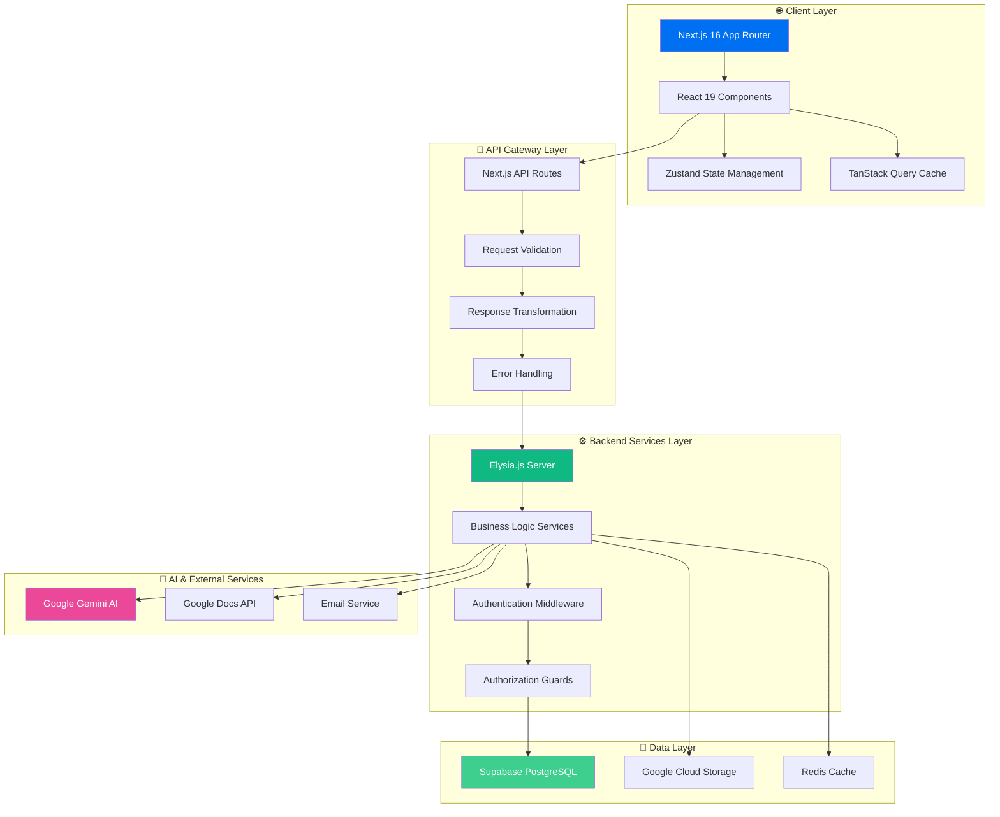
```mermaid
graph TB
    subgraph "🌐 Client Layer"
        A[Next.js 16 App Router]
        B[React 19 Components]
        C[Zustand State Management]
        D[TanStack Query Cache]
    end

    subgraph "🔌 API Gateway Layer"
        E[Next.js API Routes]
        F[Request Validation]
        G[Response Transformation]
        H[Error Handling]
    end

    subgraph "⚙️ Backend Services Layer"
        I[Elysia.js Server]
        J[Business Logic Services]
        K[Authentication Middleware]
        L[Authorization Guards]
    end

    subgraph "💾 Data Layer"
        M[Supabase PostgreSQL]
        N[Google Cloud Storage]
        O[Redis Cache]
    end

    subgraph "🤖 AI & External Services"
        P[Google Gemini AI]
        Q[Google Docs API]
        R[Email Service]
    end

    A --> B
    B --> C
    B --> D
    B --> E
    E --> F
    F --> G
    G --> H
    H --> I
    I --> J
    J --> K
    K --> L
    L --> M
    J --> N
    J --> O
    J --> P
    J --> Q
    J --> R

    style A fill:#0070f3,color:#fff
    style I fill:#10b981,color:#fff
    style M fill:#3ecf8e,color:#fff
    style P fill:#ec4899,color:#fff
```

### System Components

#### Frontend Architecture

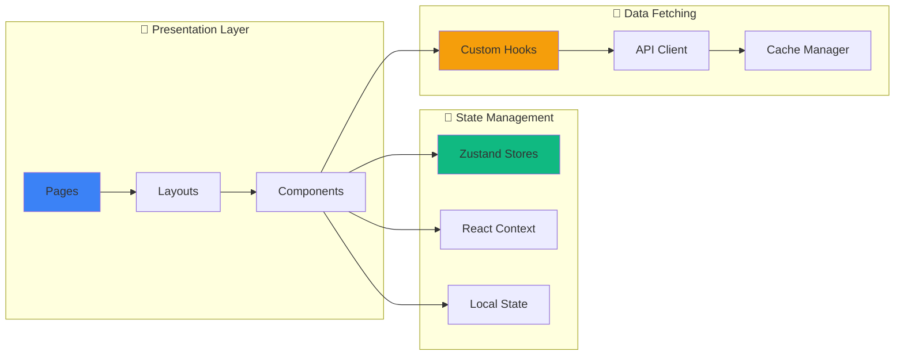
```mermaid
graph LR
    subgraph "📱 Presentation Layer"
        A[Pages] --> B[Layouts]
        B --> C[Components]
    end

    subgraph "🔄 State Management"
        D[Zustand Stores]
        E[React Context]
        F[Local State]
    end

    subgraph "📡 Data Fetching"
        G[Custom Hooks]
        H[API Client]
        I[Cache Manager]
    end

    C --> D
    C --> E
    C --> F
    C --> G
    G --> H
    H --> I

    style A fill:#3b82f6
    style D fill:#10b981
    style G fill:#f59e0b
```

#### Backend Architecture

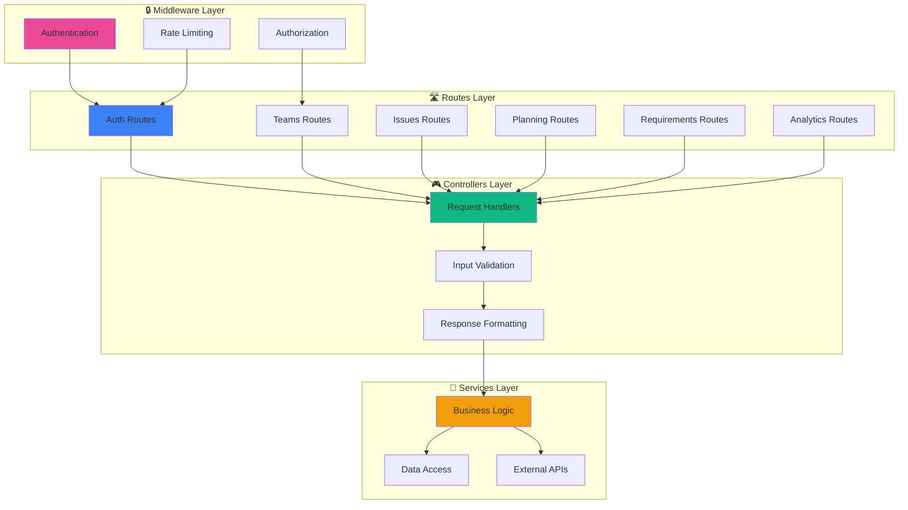
```mermaid
graph TB
    subgraph "🛣️ Routes Layer"
        A[Auth Routes]
        B[Teams Routes]
        C[Issues Routes]
        D[Planning Routes]
        E[Requirements Routes]
        F[Analytics Routes]
    end

    subgraph "🎮 Controllers Layer"
        G[Request Handlers]
        H[Input Validation]
        I[Response Formatting]
    end

    subgraph "💼 Services Layer"
        J[Business Logic]
        K[Data Access]
        L[External APIs]
    end

    subgraph "🔒 Middleware Layer"
        M[Authentication]
        N[Authorization]
        O[Rate Limiting]
    end

    A --> G
    B --> G
    C --> G
    D --> G
    E --> G
    F --> G

    G --> H
    H --> I
    I --> J
    J --> K
    J --> L

    M --> A
    N --> B
    O --> A

    style A fill:#3b82f6
    style G fill:#10b981
    style J fill:#f59e0b
    style M fill:#ec4899
```

## 🔄 Alur Kerja Aplikasi

### User Journey Flow

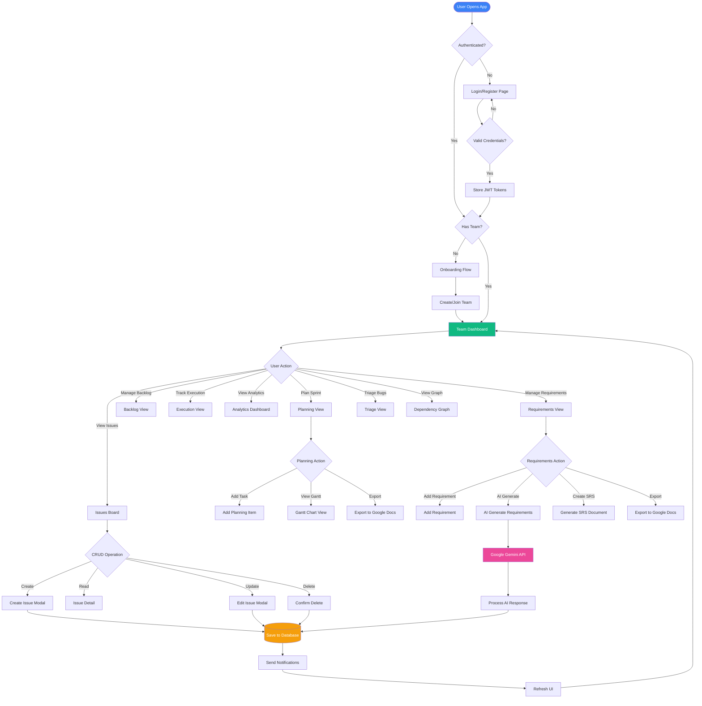
```mermaid
flowchart TB
    Start([User Opens App]) --> Auth{Authenticated?}

    Auth -->|No| Login[Login/Register Page]
    Login --> Verify{Valid Credentials?}
    Verify -->|No| Login
    Verify -->|Yes| StoreToken[Store JWT Tokens]

    Auth -->|Yes| CheckTeam{Has Team?}
    StoreToken --> CheckTeam

    CheckTeam -->|No| Onboarding[Onboarding Flow]
    Onboarding --> CreateTeam[Create/Join Team]
    CreateTeam --> Dashboard

    CheckTeam -->|Yes| Dashboard[Team Dashboard]

    Dashboard --> Actions{User Action}

    Actions -->|View Issues| IssuesBoard[Issues Board]
    Actions -->|Plan Sprint| Planning[Planning View]
    Actions -->|Manage Backlog| Backlog[Backlog View]
    Actions -->|Track Execution| Execution[Execution View]
    Actions -->|View Analytics| Analytics[Analytics Dashboard]
    Actions -->|Manage Requirements| Requirements[Requirements View]
    Actions -->|Triage Bugs| Triage[Triage View]
    Actions -->|View Graph| Graph[Dependency Graph]

    IssuesBoard --> CRUD{CRUD Operation}
    CRUD -->|Create| CreateIssue[Create Issue Modal]
    CRUD -->|Read| ViewIssue[Issue Detail]
    CRUD -->|Update| EditIssue[Edit Issue Modal]
    CRUD -->|Delete| DeleteIssue[Confirm Delete]

    CreateIssue --> SaveDB[(Save to Database)]
    EditIssue --> SaveDB
    DeleteIssue --> SaveDB

    SaveDB --> Notify[Send Notifications]
    Notify --> Refresh[Refresh UI]
    Refresh --> Dashboard

    Planning --> PlanActions{Planning Action}
    PlanActions -->|Add Task| AddPlanning[Add Planning Item]
    PlanActions -->|View Gantt| GanttChart[Gantt Chart View]
    PlanActions -->|Export| ExportPlanning[Export to Google Docs]

    Requirements --> ReqActions{Requirements Action}
    ReqActions -->|Add Requirement| AddReq[Add Requirement]
    ReqActions -->|AI Generate| AIGen[AI Generate Requirements]
    ReqActions -->|Create SRS| SRS[Generate SRS Document]
    ReqActions -->|Export| ExportSRS[Export to Google Docs]

    AIGen --> Gemini[Google Gemini API]
    Gemini --> ProcessAI[Process AI Response]
    ProcessAI --> SaveDB

    style Start fill:#3b82f6,color:#fff
    style Dashboard fill:#10b981,color:#fff
    style SaveDB fill:#f59e0b,color:#fff
    style Gemini fill:#ec4899,color:#fff
```

### Request-Response Flow

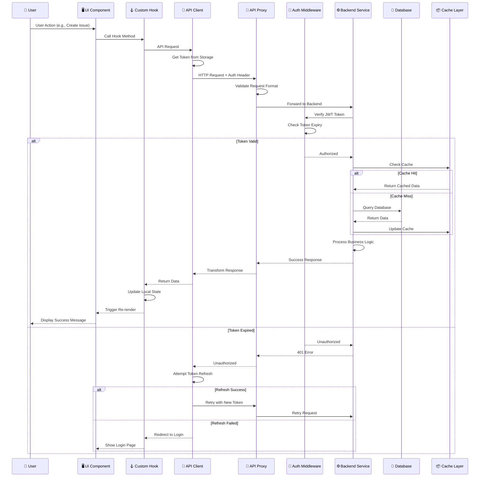
```mermaid
sequenceDiagram
    participant U as 👤 User
    participant UI as 🖥️ UI Component
    participant Hook as 🪝 Custom Hook
    participant API as 🔌 API Client
    participant Proxy as 🚪 API Proxy
    participant Auth as 🔐 Auth Middleware
    participant Backend as ⚙️ Backend Service
    participant DB as 💾 Database
    participant Cache as 📦 Cache Layer

    U->>UI: User Action (e.g., Create Issue)
    UI->>Hook: Call Hook Method
    Hook->>API: API Request

    API->>API: Get Token from Storage
    API->>Proxy: HTTP Request + Auth Header

    Proxy->>Proxy: Validate Request Format
    Proxy->>Backend: Forward to Backend

    Backend->>Auth: Verify JWT Token
    Auth->>Auth: Check Token Expiry

    alt Token Valid
        Auth-->>Backend: Authorized
        Backend->>Cache: Check Cache

        alt Cache Hit
            Cache-->>Backend: Return Cached Data
        else Cache Miss
            Backend->>DB: Query Database
            DB-->>Backend: Return Data
            Backend->>Cache: Update Cache
        end

        Backend->>Backend: Process Business Logic
        Backend-->>Proxy: Success Response
        Proxy-->>API: Transform Response
        API-->>Hook: Return Data
        Hook->>Hook: Update Local State
        Hook-->>UI: Trigger Re-render
        UI-->>U: Display Success Message

    else Token Expired
        Auth-->>Backend: Unauthorized
        Backend-->>Proxy: 401 Error
        Proxy-->>API: Unauthorized
        API->>API: Attempt Token Refresh

        alt Refresh Success
            API->>Proxy: Retry with New Token
            Proxy->>Backend: Retry Request
        else Refresh Failed
            API-->>Hook: Redirect to Login
            Hook-->>UI: Show Login Page
        end
    end
```

---

## 🛠️ Tech Stack

### Frontend

- **Framework**: Next.js 16 (App Router)
- **Language**: TypeScript 5.9
- **Styling**: Tailwind CSS 4
- **UI Components**: Custom Design System
- **Animation**: Motion (Framer Motion v11+)
- **Icons**: Lucide React
- **State Management**: Zustand
- **Drag & Drop**: @dnd-kit

### Backend

- **Runtime**: Bun
- **Framework**: Elysia.js
- **Database**: Supabase (PostgreSQL)
- **Authentication**: JWT
- **Storage**: Google Cloud Storage
- **API Integration**: Google Docs API

### DevOps

- **Monorepo**: Turborepo
- **Package Manager**: Bun
- **Linting**: ESLint
- **Formatting**: Prettier

---

## 📁 Struktur Proyek

```
taskops/
├── apps/
│   ├── web/                 # Next.js Frontend
│   │   ├── src/
│   │   │   ├── app/        # App Router pages
│   │   │   ├── components/ # React components
│   │   │   ├── hooks/      # Custom hooks
│   │   │   ├── lib/        # Utilities
│   │   │   ├── store/      # Zustand stores
│   │   │   └── types/      # TypeScript types
│   │   └── public/         # Static assets
│   │
│   └── server/             # Elysia.js Backend
│       ├── src/
│       │   ├── controllers/
│       │   ├── services/
│       │   ├── middleware/
│       │   ├── routes/
│       │   └── types/
│       └── database-migration-*.sql
│
├── packages/               # Shared packages
├── LICENSE                # Proprietary license
└── README.md             # This file
```

---

## 🚀 Quick Start

### Prerequisites

- Node.js 18+ atau Bun 1.2+
- PostgreSQL (via Supabase)
- Google Cloud Account (untuk storage)

### Installation

```bash
# Clone repository
git clone <repository-url>
cd taskops

# Install dependencies
bun install

# Setup environment variables
cp apps/web/.env.local.example apps/web/.env.local
cp apps/server/.env.example apps/server/.env

# Edit .env files dengan credentials Anda

# Run database migrations
# Jalankan file SQL di apps/server/migrations/*.sql di Supabase SQL Editor
```

### Development

#### Option 1: Automatic (Recommended)

```bash
# Windows
.\start-dev.ps1

# Linux/Mac
chmod +x start-dev.sh
./start-dev.sh
```

Script ini akan:

- Install dependencies otomatis
- Start backend server (port 3000)
- Start frontend server (port 3001)
- Membuka 2 terminal terpisah untuk monitoring

#### Option 2: Manual

```bash
# Terminal 1 - Backend
cd apps/server
bun run dev
# Backend akan berjalan di http://localhost:3000

# Terminal 2 - Frontend
cd apps/web
bun run dev
# Frontend akan berjalan di http://localhost:3001
```

### Akses Aplikasi

- **Frontend**: http://localhost:3001
- **Backend API**: http://localhost:3000
- **API Docs**: http://localhost:3000/docs

### Troubleshooting

Jika mengalami error "Infinite Loop Terdeteksi", pastikan:

1. Backend berjalan di port 3000
2. Frontend berjalan di port 3001
3. File `.env.local` berisi `BACKEND_URL=http://localhost:3000`

Lihat [DEVELOPMENT_SETUP.md](./apps/web/DEVELOPMENT_SETUP.md) untuk panduan lengkap.

---

## 📚 Dokumentasi

### Quick Start

- **[Web App README](./apps/web/README.md)** - Dokumentasi frontend lengkap
- **[Server README](./apps/server/README.md)** - Dokumentasi backend lengkap

### Development Guides

- **[AGENTS.md](./apps/web/AGENTS.md)** - Panduan lengkap untuk developer
- **[ARCHITECTURE.md](./apps/web/ARCHITECTURE.md)** - Arsitektur aplikasi
- **[API Documentation](./apps/web/src/app/api/README.md)** - API endpoints

---

### Tentang Amertarva

Amertarva adalah tim pengembangan software di bawah PT Amerta Learning yang fokus pada pembuatan solusi digital berkualitas tinggi untuk pasar Indonesia.

**Follow kami**: [Instagram @amertarva](https://www.instagram.com/amertarva/)

---

## 📦 Scripts

```bash
# Development
bun dev              # Start all apps in development mode
bun dev --filter=web # Start only web app

# Build
bun build            # Build all apps for production

# Linting & Formatting
bun lint             # Run ESLint
bun format           # Format code with Prettier
bun check-types      # TypeScript type checking
```

---

## 🔒 Lisensi & Keamanan

Amertaask adalah software proprietary yang dilindungi hak cipta.

- **Copyright**: © 2026 Amertarva - PT Amerta Learning
- **License**: Proprietary Software License
- **Status**: All Rights Reserved

Lihat [LICENSE](./LICENSE) untuk detail lengkap.

### Keamanan

Untuk melaporkan kerentanan keamanan, silakan hubungi tim kami melalui:

- Email: security@amertarva.com
- Instagram: [@amertarva](https://www.instagram.com/amertarva/)

---

## 🤝 Dukungan & Kontak

### Subscription & Enterprise

Tertarik menggunakan Amertaask untuk tim atau perusahaan Anda?

- 📧 Email: sales@amertarva.com
- 📱 Instagram: [@amertarva](https://www.instagram.com/amertarva/)
- 🏢 PT Amerta Learning

### Support

Butuh bantuan? Hubungi kami:

- 📧 Email: support@amertarva.com
- 📱 Instagram: [@amertarva](https://www.instagram.com/amertarva/)

---

## 🎯 Roadmap

- [ ] Mobile App (React Native)
- [ ] Advanced Analytics Dashboard
- [ ] Time Tracking Integration
- [ ] Automation & Workflows
- [ ] API Public untuk Integrasi
- [ ] Slack/Discord Integration
- [ ] Advanced Reporting
- [ ] Custom Fields & Templates

---

<div align="center">

### Dibuat oleh Tim Amertarva

**PT Amerta Learning** • **Indonesia**

[Instagram](https://www.instagram.com/amertarva/) • [Website](#) • [Contact](#)

---

© 2026 Amertarva - PT Amerta Learning. All Rights Reserved.

</div>
