# Amertask Frontend Architecture

## 🏗️ Architecture Overview

This document provides a comprehensive overview of the Amertask frontend architecture, built with Next.js 16, React 19, and modern web technologies.

---

## 📐 System Architecture

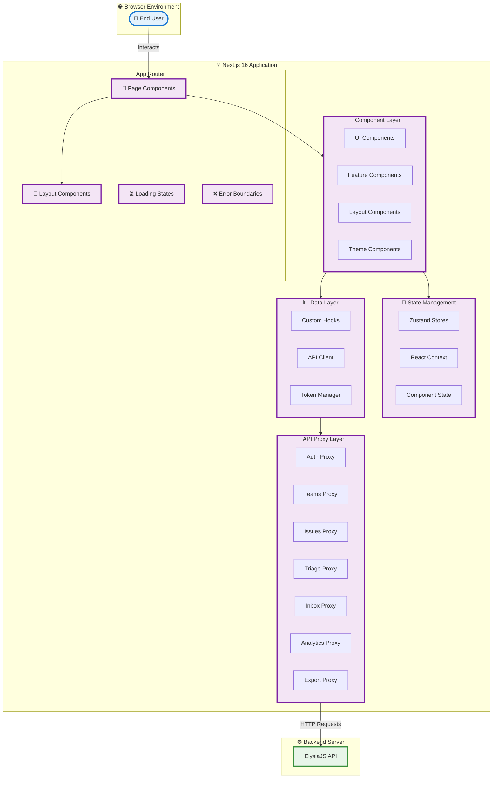

---

## 🔄 Request Flow Architecture

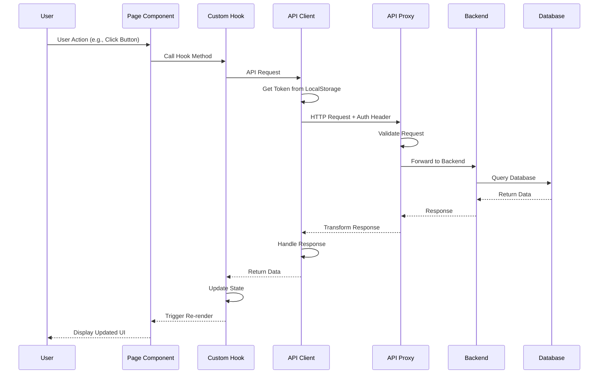

---

## 📁 Directory Structure

```
apps/web/
├── src/
│   ├── app/                          # Next.js App Router
│   │   ├── api/                      # API Proxy Routes
│   │   │   ├── _lib/                 # Shared proxy utilities
│   │   │   ├── auth/                 # Auth endpoints
│   │   │   │   ├── login/
│   │   │   │   ├── register/
│   │   │   │   ├── refresh/
│   │   │   │   └── logout/
│   │   │   ├── users/                # User endpoints
│   │   │   │   └── me/
│   │   │   ├── teams/                # Team endpoints
│   │   │   │   ├── invitations/
│   │   │   │   └── [teamSlug]/
│   │   │   │       ├── analytics/
│   │   │   │       ├── export/
│   │   │   │       ├── invite/
│   │   │   │       ├── issues/
│   │   │   │       └── settings/
│   │   │   ├── issues/               # Issue endpoints
│   │   │   │   └── [id]/
│   │   │   ├── triage/               # Triage endpoints
│   │   │   │   └── [id]/
│   │   │   ├── inbox/                # Inbox endpoints
│   │   │   └── health/               # Health check
│   │   │
│   │   ├── auth/                     # Authentication Pages
│   │   │   ├── login/
│   │   │   └── register/
│   │   │
│   │   ├── home/                     # Home & Onboarding
│   │   │   ├── new-project/
│   │   │   ├── settings/
│   │   │   ├── layout.tsx
│   │   │   └── page.tsx
│   │   │
│   │   ├── join/                     # Team Invitation
│   │   │   └── [teamSlug]/
│   │   │
│   │   ├── projects/                 # Project Dashboard
│   │   │   ├── [teamSlug]/           # Dynamic Team Routes
│   │   │   │   ├── analytics/        # Analytics Dashboard
│   │   │   │   ├── backlog/          # Product Backlog
│   │   │   │   ├── execution/        # Execution Tracking
│   │   │   │   ├── issues/           # Issue Management
│   │   │   │   ├── planning/         # Sprint Planning
│   │   │   │   ├── settings/         # Team Settings
│   │   │   │   ├── team/             # Team Members
│   │   │   │   ├── triage/           # Bug Triage
│   │   │   │   └── page.tsx          # Team Dashboard
│   │   │   ├── inbox/                # Notifications Inbox
│   │   │   ├── layout.tsx
│   │   │   └── README.md
│   │   │
│   │   ├── layout.tsx                # Root Layout
│   │   ├── page.tsx                  # Landing Page
│   │   └── globals.css               # Global Styles
│   │
│   ├── components/                   # React Components
│   │   ├── auth/                     # Authentication Components
│   │   │   ├── LoginForm.tsx
│   │   │   └── RegisterForm.tsx
│   │   │
│   │   ├── dashboard/                # Dashboard Components
│   │   │   ├── analytics/            # Analytics Components
│   │   │   ├── backlog/              # Backlog Components
│   │   │   ├── execution/            # Execution Components
│   │   │   ├── issues/               # Issue Components
│   │   │   │   ├── IssuesBoard.tsx
│   │   │   │   ├── IssueCard.tsx
│   │   │   │   └── IssueFilters.tsx
│   │   │   ├── planning/             # Planning Components
│   │   │   ├── team/                 # Team Components
│   │   │   │   ├── MemberCard.tsx
│   │   │   │   └── MemberList.tsx
│   │   │   └── triage/               # Triage Components
│   │   │
│   │   ├── layout/                   # Layout Components
│   │   │   ├── Navbar.tsx
│   │   │   ├── Sidebar.tsx
│   │   │   ├── Footer.tsx
│   │   │   └── Container.tsx
│   │   │
│   │   ├── modals/                   # Modal Components
│   │   │   ├── CreateIssueModal.tsx
│   │   │   ├── EditIssueModal.tsx
│   │   │   └── ConfirmModal.tsx
│   │   │
│   │   ├── onboarding/               # Onboarding Components
│   │   │   ├── OnboardingHome.tsx
│   │   │   └── CreateProjectForm.tsx
│   │   │
│   │   ├── settings/                 # Settings Components
│   │   │   ├── SystemSettings.tsx
│   │   │   └── TeamSettings.tsx
│   │   │
│   │   ├── tables/                   # Table Components
│   │   │   ├── IssuesTable.tsx
│   │   │   └── MembersTable.tsx
│   │   │
│   │   └── themes/                   # Theme Components
│   │       ├── ThemeProvider.tsx
│   │       └── ThemeSelector.tsx
│   │
│   ├── contexts/                     # React Contexts
│   │   ├── AuthContext.tsx
│   │   └── ThemeContext.tsx
│   │
│   ├── hooks/                        # Custom Hooks
│   │   ├── useAuth.ts                # Authentication Hook
│   │   ├── useTeams.ts               # Teams Hook
│   │   ├── useIssues.ts              # Issues Hook
│   │   ├── useTriage.ts              # Triage Hook
│   │   ├── useInbox.ts               # Inbox Hook
│   │   ├── useAnalytics.ts           # Analytics Hook
│   │   └── useTheme.ts               # Theme Hook
│   │
│   ├── lib/                          # Utilities & Libraries
│   │   ├── core/                     # Core API Client
│   │   │   ├── http.ts               # HTTP Client
│   │   │   ├── token.ts              # Token Manager
│   │   │   ├── auth.api.ts           # Auth API
│   │   │   ├── users.api.ts          # Users API
│   │   │   ├── teams.api.ts          # Teams API
│   │   │   ├── issues.api.ts         # Issues API
│   │   │   ├── triage.api.ts         # Triage API
│   │   │   ├── inbox.api.ts          # Inbox API
│   │   │   └── analytics.api.ts      # Analytics API
│   │   │
│   │   ├── utils/                    # Utility Functions
│   │   │   ├── cn.ts                 # Class Name Utility
│   │   │   ├── date.ts               # Date Utilities
│   │   │   └── format.ts             # Format Utilities
│   │   │
│   │   └── constants.ts              # Constants
│   │
│   ├── store/                        # Zustand Stores
│   │   ├── authStore.ts              # Auth State
│   │   ├── teamStore.ts              # Team State
│   │   └── themeStore.ts             # Theme State
│   │
│   ├── styles/                       # Styles
│   │   └── themes/                   # Theme Styles
│   │       ├── default.css
│   │       ├── school.css
│   │       └── work.css
│   │
│   └── types/                        # TypeScript Types
│       ├── index.ts                  # Main Types
│       ├── api.ts                    # API Types
│       └── models.ts                 # Data Models
│
├── public/                           # Static Assets
│   ├── company-logos/
│   │   └── amertask.svg
│   └── img/
│
├── e2e/                              # E2E Tests
│   └── auth-teams-race.spec.ts
│
├── .env.local                        # Environment Variables
├── next.config.ts                    # Next.js Config
├── tailwind.config.ts                # Tailwind Config
├── tsconfig.json                     # TypeScript Config
└── package.json                      # Dependencies
```

---

## 🎯 Core Architectural Patterns

### 1. API Proxy Pattern

The frontend uses Next.js API Routes as a proxy layer between the client and backend:

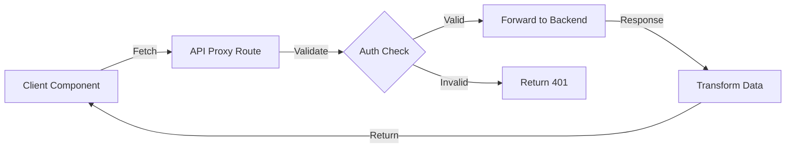

**Benefits:**

- Hide backend URL from client
- Add request/response transformation
- Centralized error handling
- Easy to add caching layer
- Better security

**Example:**

```typescript
// apps/web/src/app/api/teams/route.ts
export async function GET(request: Request) {
  const token = request.headers.get("authorization");

  // Forward to backend
  const response = await fetch(`${BACKEND_URL}/teams`, {
    headers: { authorization: token },
  });

  return Response.json(await response.json());
}
```

### 2. Custom Hooks Pattern

All data fetching and state management is encapsulated in custom hooks:

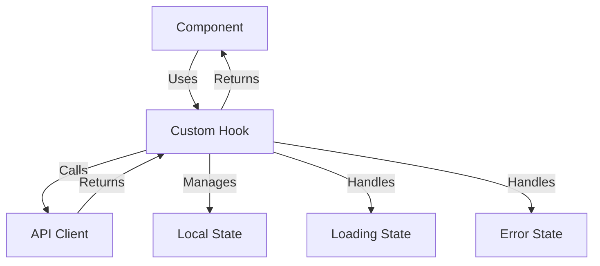

**Example:**

```typescript
// apps/web/src/hooks/useIssues.ts
export function useIssues(teamSlug: string) {
  const [issues, setIssues] = useState([]);
  const [loading, setLoading] = useState(false);
  const [error, setError] = useState(null);

  const fetchIssues = async () => {
    setLoading(true);
    try {
      const data = await issuesApi.list(teamSlug);
      setIssues(data);
    } catch (err) {
      setError(err);
    } finally {
      setLoading(false);
    }
  };

  return { issues, loading, error, fetchIssues };
}
```

### 3. Token Management Pattern

JWT tokens are managed through a centralized token manager:

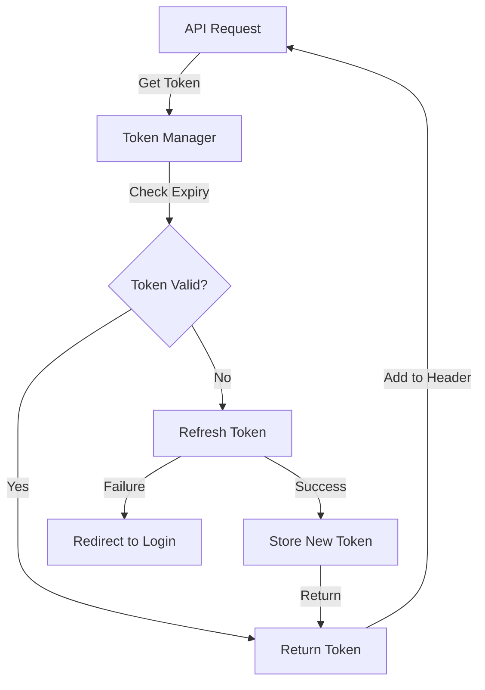

**Features:**

- Automatic token refresh
- Token expiry checking
- Secure storage in localStorage
- Automatic logout on refresh failure

### 4. Component Composition Pattern

Components are built using composition for maximum reusability:

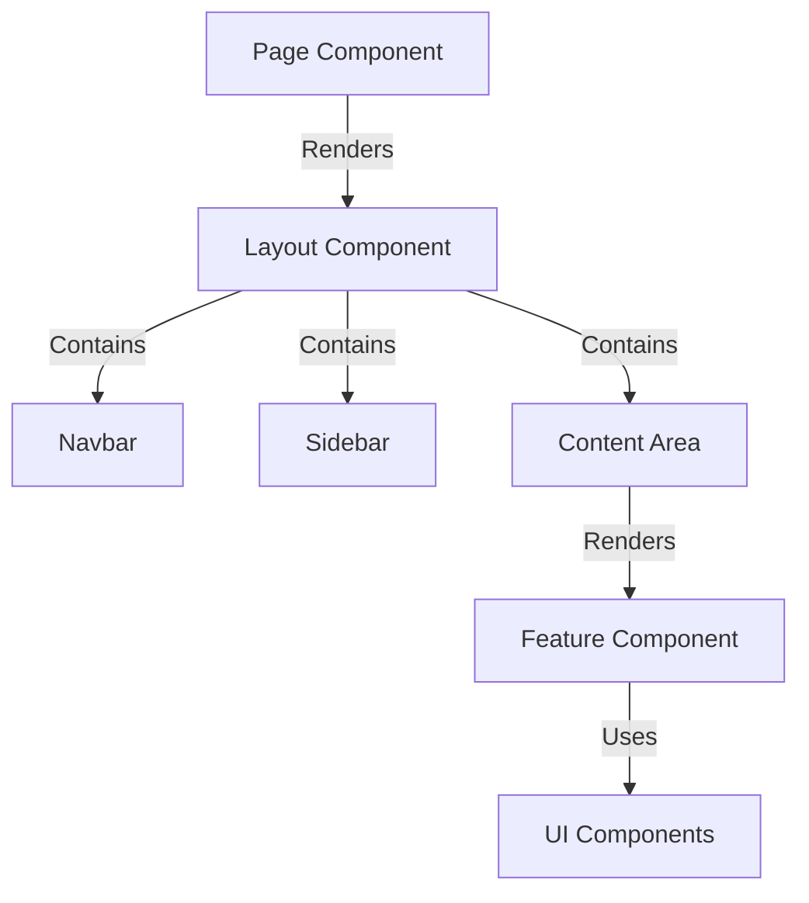

---

## 🔐 Authentication Flow

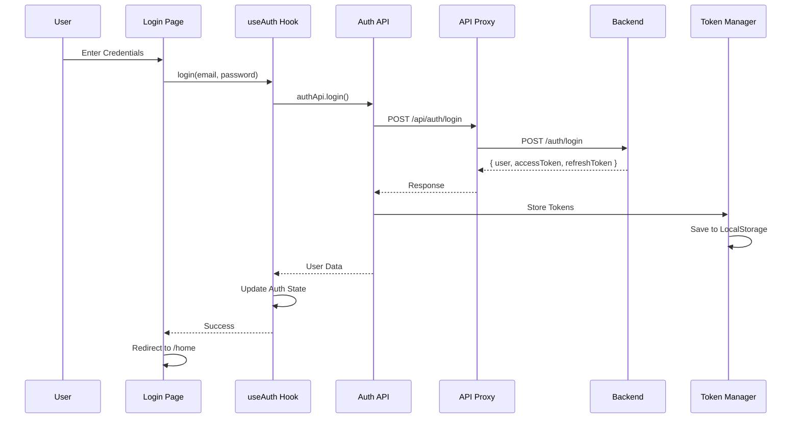

### Token Refresh Flow

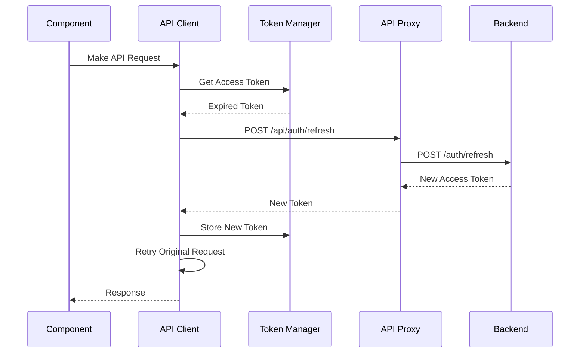

---

## 📊 State Management

### Zustand Stores

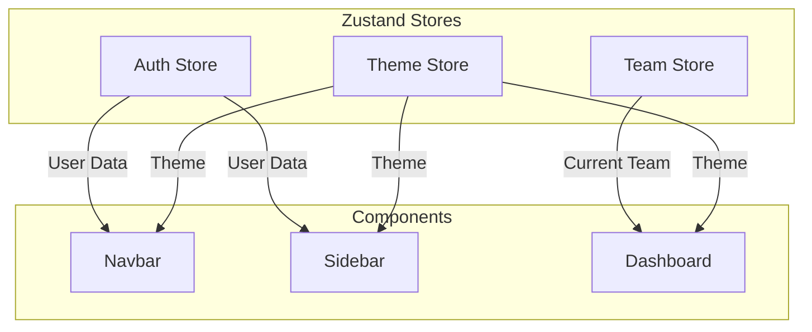

**Auth Store:**

```typescript
interface AuthStore {
  user: User | null;
  isAuthenticated: boolean;
  login: (user: User) => void;
  logout: () => void;
}
```

**Team Store:**

```typescript
interface TeamStore {
  currentTeam: Team | null;
  teams: Team[];
  setCurrentTeam: (team: Team) => void;
  setTeams: (teams: Team[]) => void;
}
```

**Theme Store:**

```typescript
interface ThemeStore {
  theme: "default" | "school" | "work";
  colorScheme: "light" | "dark";
  setTheme: (theme: string) => void;
  setColorScheme: (scheme: string) => void;
}
```

---

## 🎨 Theming System

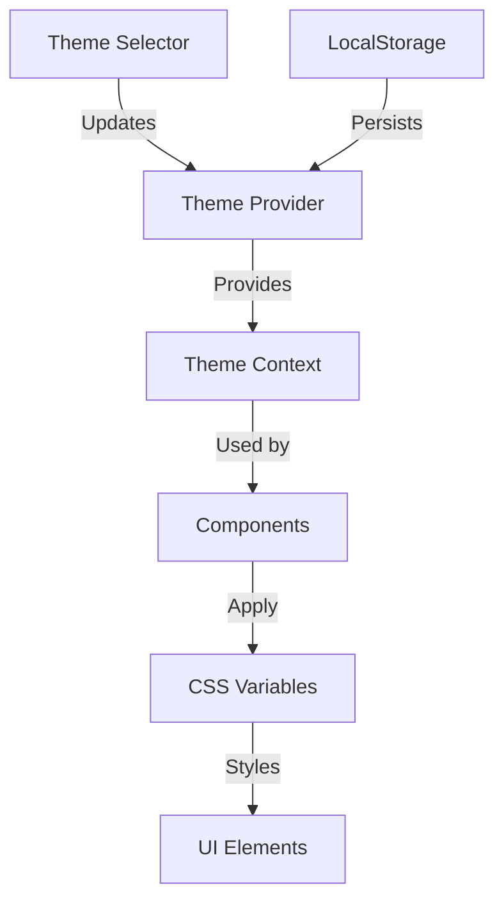

### Theme Structure

```css
/* Default Theme */
:root {
  --primary: #3b82f6;
  --secondary: #8b5cf6;
  --background: #ffffff;
  --foreground: #000000;
}

/* School Theme */
[data-theme="school"] {
  --primary: #10b981;
  --secondary: #06b6d4;
  --background: #f0fdf4;
  --foreground: #064e3b;
}

/* Work Theme */
[data-theme="work"] {
  --primary: #6366f1;
  --secondary: #a855f7;
  --background: #fafafa;
  --foreground: #18181b;
}
```

---

## 🔄 Data Flow

### Issue Management Flow

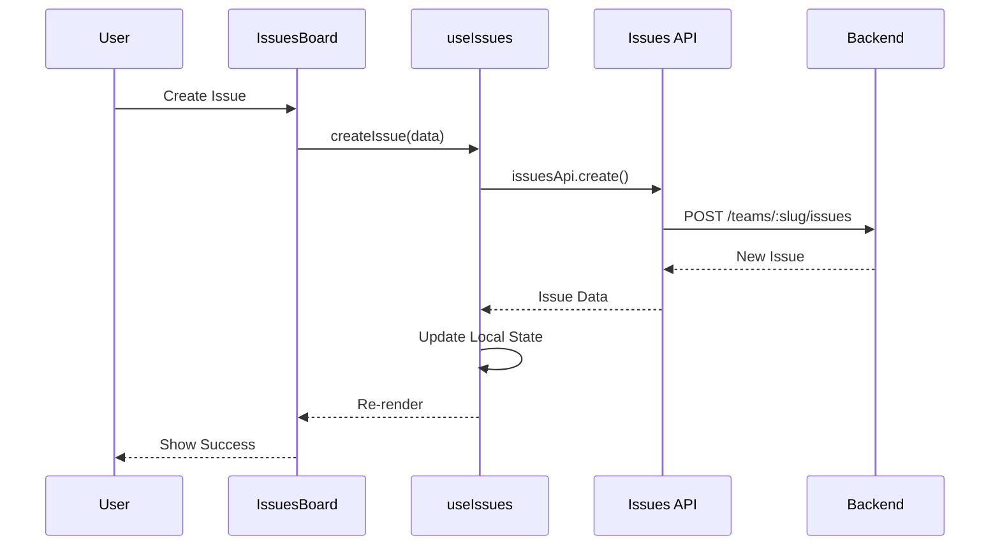

### Real-time Notifications

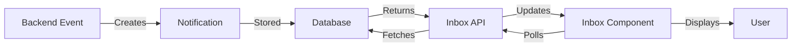

---

## 🚀 Performance Optimizations

### 1. Code Splitting

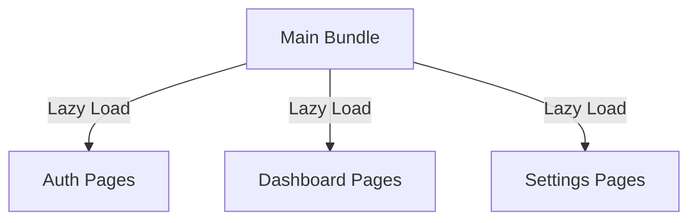

### 2. Image Optimization

- Next.js Image component for automatic optimization
- WebP format with fallbacks
- Lazy loading for images below the fold
- Responsive images with srcset

### 3. Caching Strategy

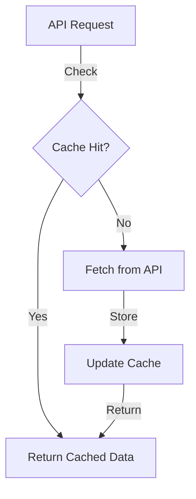

### 4. Bundle Optimization

- Tree shaking for unused code
- Dynamic imports for large components
- Minification and compression
- CSS purging with Tailwind

---

## 🧪 Testing Strategy

### Unit Tests

```typescript
// Component Tests
describe("IssuesBoard", () => {
  it("renders issues correctly", () => {
    // Test implementation
  });
});

// Hook Tests
describe("useIssues", () => {
  it("fetches issues on mount", () => {
    // Test implementation
  });
});
```

### E2E Tests

```typescript
// Playwright Tests
test("user can create issue", async ({ page }) => {
  await page.goto("/projects/my-team/issues");
  await page.click('[data-testid="create-issue"]');
  await page.fill('[name="title"]', "New Issue");
  await page.click('[type="submit"]');
  await expect(page.locator(".issue-card")).toContainText("New Issue");
});
```

---

## 🔒 Security Measures

### 1. XSS Prevention

- React's built-in XSS protection
- Sanitize user input
- Content Security Policy headers

### 2. CSRF Protection

- SameSite cookies
- CSRF tokens for state-changing operations

### 3. Authentication Security

- JWT tokens with short expiry
- Refresh token rotation
- Secure token storage
- Automatic logout on token expiry

### 4. API Security

- Authorization header validation
- Rate limiting (future)
- Input validation
- Error message sanitization

---

## 📱 Responsive Design

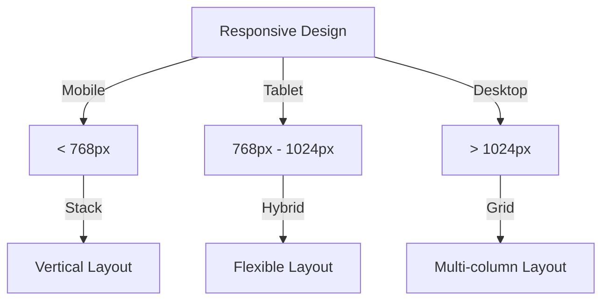

### Breakpoints

```typescript
const breakpoints = {
  sm: "640px", // Mobile
  md: "768px", // Tablet
  lg: "1024px", // Desktop
  xl: "1280px", // Large Desktop
  "2xl": "1536px", // Extra Large
};
```

---

## 🔧 Development Workflow

### 1. Local Development

```bash
# Start development server
bun run dev

# Run tests
bun run test

# Run linter
bun run lint

# Build for production
bun run build
```

### 2. Hot Module Replacement

- Instant updates without full page reload
- Preserves component state
- Fast feedback loop

### 3. TypeScript Integration

- Full type safety across the application
- IntelliSense support
- Compile-time error checking
- Better refactoring support

---

## 📈 Future Improvements

### Planned Features

- [ ] Real-time updates with WebSockets
- [ ] Offline support with Service Workers
- [ ] Advanced caching with React Query
- [ ] Optimistic UI updates
- [ ] Virtual scrolling for large lists
- [ ] Advanced analytics dashboard
- [ ] Mobile app with React Native
- [ ] GraphQL API integration

### Performance Goals

- [ ] Lighthouse score > 95
- [ ] First Contentful Paint < 1.5s
- [ ] Time to Interactive < 3s
- [ ] Bundle size < 200KB (gzipped)

---

## 📚 Additional Resources

- [Next.js Documentation](https://nextjs.org/docs)
- [React Documentation](https://react.dev/)
- [Tailwind CSS Documentation](https://tailwindcss.com/docs)
- [Zustand Documentation](https://zustand-demo.pmnd.rs/)
- [TypeScript Documentation](https://www.typescriptlang.org/docs/)

---

**Last Updated:** April 2026  
**Version:** 1.0.0  
**Maintained by:** Amertask Team
