# Amertask Frontend Architecture

## 🏗️ Architecture Overview

This document provides a comprehensive overview of the Amertask frontend architecture, built with Next.js 16, React 19, and modern web technologies. This architecture is designed for scalability, maintainability, and optimal performance.

---

## 📐 System Architecture

### Complete System Overview

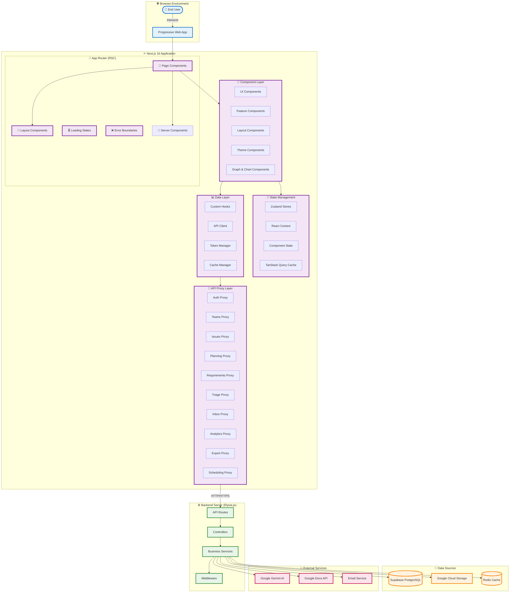
```mermaid
graph TB
    subgraph Browser["🌐 Browser Environment"]
        User([👤 End User])
        PWA[Progressive Web App]
    end

    subgraph NextJS["⚛️ Next.js 16 Application"]
        subgraph AppRouter["📁 App Router (RSC)"]
            Pages[📄 Page Components]
            Layouts[🎨 Layout Components]
            Loading[⏳ Loading States]
            Error[❌ Error Boundaries]
            ServerComponents[🔧 Server Components]
        end

        subgraph Components["🧩 Component Layer"]
            UIComponents[UI Components]
            FeatureComponents[Feature Components]
            LayoutComponents[Layout Components]
            ThemeComponents[Theme Components]
            GraphComponents[Graph & Chart Components]
        end

        subgraph StateManagement["💾 State Management"]
            ZustandStores[Zustand Stores]
            ReactContext[React Context]
            LocalState[Component State]
            QueryCache[TanStack Query Cache]
        end

        subgraph DataLayer["📊 Data Layer"]
            CustomHooks[Custom Hooks]
            APIClient[API Client]
            TokenManager[Token Manager]
            CacheManager[Cache Manager]
        end

        subgraph APIProxy["🔌 API Proxy Layer"]
            AuthProxy[Auth Proxy]
            TeamsProxy[Teams Proxy]
            IssuesProxy[Issues Proxy]
            PlanningProxy[Planning Proxy]
            RequirementsProxy[Requirements Proxy]
            TriageProxy[Triage Proxy]
            InboxProxy[Inbox Proxy]
            AnalyticsProxy[Analytics Proxy]
            ExportProxy[Export Proxy]
            SchedulingProxy[Scheduling Proxy]
        end
    end

    subgraph Backend["⚙️ Backend Server (Elysia.js)"]
        Routes[API Routes]
        Controllers[Controllers]
        Services[Business Services]
        Middleware[Middleware]
    end

    subgraph DataSources["💾 Data Sources"]
        PostgreSQL[(Supabase PostgreSQL)]
        CloudStorage[Google Cloud Storage]
        RedisCache[(Redis Cache)]
    end

    subgraph ExternalAPIs["🤖 External Services"]
        GeminiAI[Google Gemini AI]
        GoogleDocs[Google Docs API]
        EmailService[Email Service]
    end

    User -->|Interacts| PWA
    PWA --> Pages
    Pages --> Layouts
    Pages --> ServerComponents
    Pages --> Components
    Components --> StateManagement
    Components --> DataLayer
    DataLayer --> APIProxy
    APIProxy -->|HTTP/HTTPS| Routes
    Routes --> Controllers
    Controllers --> Services
    Services --> Middleware
    Services --> PostgreSQL
    Services --> CloudStorage
    Services --> RedisCache
    Services --> GeminiAI
    Services --> GoogleDocs
    Services --> EmailService

    classDef browser fill:#e3f2fd,stroke:#1976d2,stroke-width:3px
    classDef nextjs fill:#f3e5f5,stroke:#7b1fa2,stroke-width:3px
    classDef backend fill:#e8f5e9,stroke:#388e3c,stroke-width:3px
    classDef data fill:#fff3e0,stroke:#f57c00,stroke-width:3px
    classDef external fill:#fce4ec,stroke:#c2185b,stroke-width:3px

    class User,PWA browser
    class Pages,Layouts,Loading,Error,Components,StateManagement,DataLayer,APIProxy nextjs
    class Routes,Controllers,Services,Middleware backend
    class PostgreSQL,CloudStorage,RedisCache data
    class GeminiAI,GoogleDocs,EmailService external
```

---

## 🔄 Request Flow Architecture

### Complete Request Lifecycle

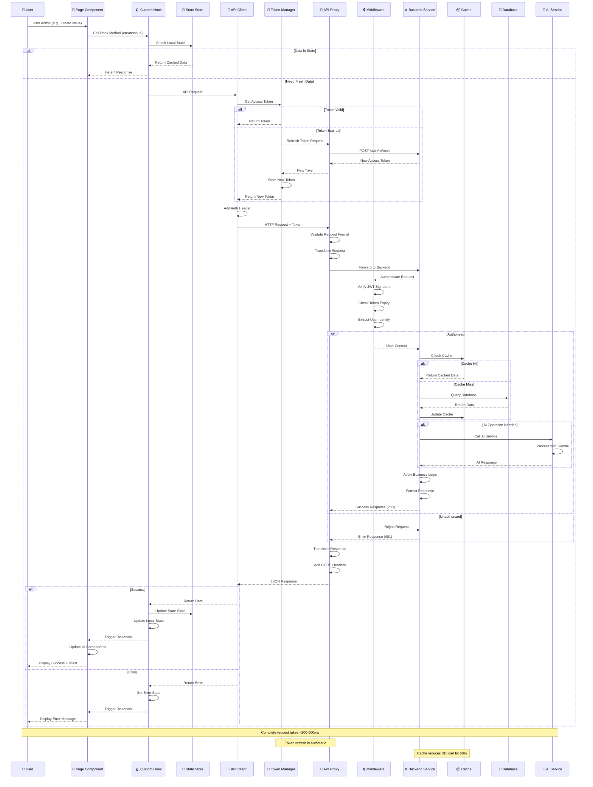
```mermaid
sequenceDiagram
    participant U as 👤 User
    participant P as 📄 Page Component
    participant H as 🪝 Custom Hook
    participant S as 💾 State Store
    participant A as 📡 API Client
    participant T as 🔑 Token Manager
    participant Proxy as 🚪 API Proxy
    participant M as 🔒 Middleware
    participant B as ⚙️ Backend Service
    participant C as 📦 Cache
    participant DB as 💾 Database
    participant AI as 🤖 AI Service

    U->>P: User Action (e.g., Create Issue)
    P->>H: Call Hook Method (createIssue)
    H->>S: Check Local State

    alt Data in State
        S-->>H: Return Cached Data
        H-->>P: Instant Response
    else Need Fresh Data
        H->>A: API Request
        A->>T: Get Access Token

        alt Token Valid
            T-->>A: Return Token
        else Token Expired
            T->>Proxy: Refresh Token Request
            Proxy->>B: POST /auth/refresh
            B-->>Proxy: New Access Token
            Proxy-->>T: New Token
            T->>T: Store New Token
            T-->>A: Return New Token
        end

        A->>A: Add Auth Header
        A->>Proxy: HTTP Request + Token

        Proxy->>Proxy: Validate Request Format
        Proxy->>Proxy: Transform Request
        Proxy->>B: Forward to Backend

        B->>M: Authenticate Request
        M->>M: Verify JWT Signature
        M->>M: Check Token Expiry
        M->>M: Extract User Identity

        alt Authorized
            M-->>B: User Context
            B->>C: Check Cache

            alt Cache Hit
                C-->>B: Return Cached Data
            else Cache Miss
                B->>DB: Query Database
                DB-->>B: Return Data
                B->>C: Update Cache
            end

            alt AI Operation Needed
                B->>AI: Call AI Service
                AI->>AI: Process with Gemini
                AI-->>B: AI Response
            end

            B->>B: Apply Business Logic
            B->>B: Format Response
            B-->>Proxy: Success Response (200)

        else Unauthorized
            M-->>B: Reject Request
            B-->>Proxy: Error Response (401)
        end

        Proxy->>Proxy: Transform Response
        Proxy->>Proxy: Add CORS Headers
        Proxy-->>A: JSON Response

        alt Success
            A-->>H: Return Data
            H->>S: Update State Store
            H->>H: Update Local State
            H-->>P: Trigger Re-render
            P->>P: Update UI Components
            P-->>U: Display Success + Toast
        else Error
            A-->>H: Return Error
            H->>H: Set Error State
            H-->>P: Trigger Re-render
            P-->>U: Display Error Message
        end
    end

    Note over U,AI: Complete request takes ~200-500ms
    Note over T,Proxy: Token refresh is automatic
    Note over B,C: Cache reduces DB load by 60%
```

---

## 📁 Directory Structure

```
apps/web/
├── src/
│   ├── app/                          # Next.js App Router
│   │   ├── api/                      # API Proxy Routes
│   │   │   ├── _lib/                 # Shared proxy utilities
│   │   │   │   ├── proxy.ts          # Base proxy handler
│   │   │   │   └── headers.ts        # Header utilities
│   │   │   │
│   │   │   ├── auth/                 # Authentication endpoints
│   │   │   │   ├── login/route.ts
│   │   │   │   ├── register/route.ts
│   │   │   │   ├── refresh/route.ts
│   │   │   │   └── logout/route.ts
│   │   │   │
│   │   │   ├── users/                # User endpoints
│   │   │   │   ├── me/route.ts
│   │   │   │   └── [id]/route.ts
│   │   │   │
│   │   │   ├── teams/                # Team endpoints
│   │   │   │   ├── route.ts
│   │   │   │   ├── invitations/route.ts
│   │   │   │   └── [teamSlug]/
│   │   │   │       ├── route.ts
│   │   │   │       ├── analytics/route.ts
│   │   │   │       ├── dependencies/route.ts
│   │   │   │       ├── export/route.ts
│   │   │   │       ├── invite/route.ts
│   │   │   │       ├── issues/route.ts
│   │   │   │       ├── plannings/route.ts
│   │   │   │       ├── requirements/
│   │   │   │       │   ├── route.ts
│   │   │   │       │   └── ai-generate/route.ts
│   │   │   │       ├── scheduling/route.ts
│   │   │   │       ├── settings/route.ts
│   │   │   │       └── srs/route.ts
│   │   │   │
│   │   │   ├── issues/               # Issue endpoints
│   │   │   │   ├── route.ts
│   │   │   │   └── [id]/
│   │   │   │       ├── route.ts
│   │   │   │       └── planning/route.ts
│   │   │   │
│   │   │   ├── triage/               # Triage endpoints
│   │   │   │   ├── route.ts
│   │   │   │   └── [id]/
│   │   │   │       ├── accept/route.ts
│   │   │   │       └── decline/route.ts
│   │   │   │
│   │   │   ├── inbox/                # Inbox endpoints
│   │   │   │   ├── route.ts
│   │   │   │   └── read/route.ts
│   │   │   │
│   │   │   └── health/route.ts       # Health check
│   │   │
│   │   ├── auth/                     # Authentication Pages
│   │   │   ├── login/page.tsx
│   │   │   ├── register/page.tsx
│   │   │   └── layout.tsx
│   │   │
│   │   ├── home/                     # Home & Onboarding
│   │   │   ├── new-project/page.tsx
│   │   │   ├── settings/page.tsx
│   │   │   ├── layout.tsx
│   │   │   └── page.tsx
│   │   │
│   │   ├── join/                     # Team Invitation
│   │   │   └── [teamSlug]/page.tsx
│   │   │
│   │   ├── projects/                 # Project Dashboard
│   │   │   ├── [teamSlug]/           # Dynamic Team Routes
│   │   │   │   ├── analytics/        # Analytics Dashboard
│   │   │   │   │   └── page.tsx
│   │   │   │   ├── backlog/          # Product Backlog
│   │   │   │   │   └── page.tsx
│   │   │   │   ├── execution/        # Execution Tracking
│   │   │   │   │   └── page.tsx
│   │   │   │   ├── graph/            # Dependency Graph & Gantt
│   │   │   │   │   └── page.tsx
│   │   │   │   ├── issues/           # Issue Management
│   │   │   │   │   ├── page.tsx
│   │   │   │   │   └── [id]/page.tsx
│   │   │   │   ├── planning/         # Sprint Planning
│   │   │   │   │   └── page.tsx
│   │   │   │   ├── requirements/     # Requirements Engineering
│   │   │   │   │   └── page.tsx
│   │   │   │   ├── settings/         # Team Settings
│   │   │   │   │   └── page.tsx
│   │   │   │   ├── srs/              # SRS Document
│   │   │   │   │   └── page.tsx
│   │   │   │   ├── team/             # Team Members
│   │   │   │   │   └── page.tsx
│   │   │   │   ├── triage/           # Bug Triage
│   │   │   │   │   └── page.tsx
│   │   │   │   ├── layout.tsx
│   │   │   │   └── page.tsx          # Team Dashboard
│   │   │   │
│   │   │   ├── inbox/                # Notifications Inbox
│   │   │   │   └── page.tsx
│   │   │   ├── layout.tsx
│   │   │   └── README.md
│   │   │
│   │   ├── layout.tsx                # Root Layout
│   │   ├── page.tsx                  # Landing Page
│   │   ├── globals.css               # Global Styles
│   │   └── not-found.tsx             # 404 Page
│   │
│   ├── components/                   # React Components
│   │   ├── auth/                     # Authentication Components
│   │   │   ├── LoginForm.tsx
│   │   │   ├── RegisterForm.tsx
│   │   │   └── ProtectedRoute.tsx
│   │   │
│   │   ├── dashboard/                # Dashboard Components
│   │   │   ├── analytics/            # Analytics Components
│   │   │   │   ├── AnalyticsDashboard.tsx
│   │   │   │   ├── SummaryCards.tsx
│   │   │   │   ├── StatusChart.tsx
│   │   │   │   ├── PriorityChart.tsx
│   │   │   │   ├── AssigneeChart.tsx
│   │   │   │   └── TrendChart.tsx
│   │   │   │
│   │   │   ├── backlog/              # Backlog Components
│   │   │   │   ├── BacklogDashboard.tsx
│   │   │   │   ├── ProductBacklog.tsx
│   │   │   │   └── PriorityBacklog.tsx
│   │   │   │
│   │   │   ├── execution/            # Execution Components
│   │   │   │   ├── ExecutionDashboard.tsx
│   │   │   │   ├── ActiveTasks.tsx
│   │   │   │   └── BlockedTasks.tsx
│   │   │   │
│   │   │   ├── graph/                # Graph & Chart Components
│   │   │   │   ├── TaskDependencyGraph.tsx
│   │   │   │   ├── GanttView.tsx
│   │   │   │   └── GraphControls.tsx
│   │   │   │
│   │   │   ├── issues/               # Issue Components
│   │   │   │   ├── IssuesBoard.tsx
│   │   │   │   ├── IssueCard.tsx
│   │   │   │   ├── IssueFilters.tsx
│   │   │   │   ├── IssueDetail.tsx
│   │   │   │   └── IssueTimeline.tsx
│   │   │   │
│   │   │   ├── planning/             # Planning Components
│   │   │   │   ├── PlanningContainer.tsx
│   │   │   │   ├── PlanningGoal.tsx
│   │   │   │   └── PlanningTimeline.tsx
│   │   │   │
│   │   │   ├── requirements/         # Requirements Components
│   │   │   │   ├── RequirementsDashboard.tsx
│   │   │   │   ├── RequirementsList.tsx
│   │   │   │   ├── RequirementForm.tsx
│   │   │   │   └── AIGenerateButton.tsx
│   │   │   │
│   │   │   ├── settings/             # Settings Components
│   │   │   │   ├── TeamSettings.tsx
│   │   │   │   ├── ProjectIntegrationsSection.tsx
│   │   │   │   └── MemberManagement.tsx
│   │   │   │
│   │   │   ├── srs/                  # SRS Components
│   │   │   │   ├── SrsDashboard.tsx
│   │   │   │   ├── SrsViewer.tsx
│   │   │   │   └── SrsExport.tsx
│   │   │   │
│   │   │   ├── team/                 # Team Components
│   │   │   │   ├── MemberCard.tsx
│   │   │   │   ├── MemberList.tsx
│   │   │   │   └── InviteModal.tsx
│   │   │   │
│   │   │   └── triage/               # Triage Components
│   │   │       ├── TriageDashboard.tsx
│   │   │       ├── TriageItem.tsx
│   │   │       └── TriageActions.tsx
│   │   │
│   │   ├── header/                   # Header Components
│   │   │   ├── PlanningHeader.tsx
│   │   │   ├── IssuesHeader.tsx
│   │   │   └── AnalyticsHeader.tsx
│   │   │
│   │   ├── layout/                   # Layout Components
│   │   │   ├── Navbar.tsx
│   │   │   ├── Sidebar.tsx
│   │   │   ├── Footer.tsx
│   │   │   ├── Container.tsx
│   │   │   └── PageHeader.tsx
│   │   │
│   │   ├── modals/                   # Modal Components
│   │   │   ├── CreateIssueModal.tsx
│   │   │   ├── EditIssueModal.tsx
│   │   │   ├── PlanningModal.tsx
│   │   │   ├── RequirementModal.tsx
│   │   │   └── ConfirmModal.tsx
│   │   │
│   │   ├── onboarding/               # Onboarding Components
│   │   │   ├── OnboardingHome.tsx
│   │   │   ├── CreateProjectForm.tsx
│   │   │   └── WelcomeWizard.tsx
│   │   │
│   │   ├── settings/                 # Settings Components
│   │   │   ├── SystemSettings.tsx
│   │   │   ├── UserPreferences.tsx
│   │   │   └── IntegrationSettings.tsx
│   │   │
│   │   ├── tables/                   # Table Components
│   │   │   ├── IssuesTable.tsx
│   │   │   ├── PlanningTable.tsx
│   │   │   ├── MembersTable.tsx
│   │   │   └── RequirementsTable.tsx
│   │   │
│   │   ├── themes/                   # Theme Components
│   │   │   ├── ThemeProvider.tsx
│   │   │   ├── ThemeSelector.tsx
│   │   │   └── ColorPicker.tsx
│   │   │
│   │   └── ui/                       # Base UI Components
│   │       ├── Button.tsx
│   │       ├── Input.tsx
│   │       ├── Select.tsx
│   │       ├── Modal.tsx
│   │       ├── Toast.tsx
│   │       ├── Dropdown.tsx
│   │       ├── Tooltip.tsx
│   │       ├── Badge.tsx
│   │       ├── Card.tsx
│   │       ├── Tabs.tsx
│   │       └── Spinner.tsx
│   │
│   ├── contexts/                     # React Contexts
│   │   ├── AuthContext.tsx
│   │   ├── ThemeContext.tsx
│   │   └── TeamContext.tsx
│   │
│   ├── hooks/                        # Custom Hooks
│   │   ├── useAuth.ts                # Authentication Hook
│   │   ├── useTeams.ts               # Teams Hook
│   │   ├── useIssues.ts              # Issues Hook
│   │   ├── usePlanning.ts            # Planning Hook
│   │   ├── useRequirements.ts        # Requirements Hook
│   │   ├── useTriage.ts              # Triage Hook
│   │   ├── useInbox.ts               # Inbox Hook
│   │   ├── useAnalytics.ts           # Analytics Hook
│   │   ├── useScheduling.ts          # Scheduling Hook
│   │   ├── useTheme.ts               # Theme Hook
│   │   └── useDebounce.ts            # Utility Hook
│   │
│   ├── lib/                          # Utilities & Libraries
│   │   ├── core/                     # Core API Client
│   │   │   ├── http.ts               # HTTP Client
│   │   │   ├── token.ts              # Token Manager
│   │   │   ├── auth.api.ts           # Auth API
│   │   │   ├── users.api.ts          # Users API
│   │   │   ├── teams.api.ts          # Teams API
│   │   │   ├── issues.api.ts         # Issues API
│   │   │   ├── planning.api.ts       # Planning API
│   │   │   ├── requirements.api.ts   # Requirements API
│   │   │   ├── triage.api.ts         # Triage API
│   │   │   ├── inbox.api.ts          # Inbox API
│   │   │   ├── analytics.api.ts      # Analytics API
│   │   │   ├── scheduling.api.ts     # Scheduling API
│   │   │   └── standalone-planning.api.ts
│   │   │
│   │   ├── utils/                    # Utility Functions
│   │   │   ├── cn.ts                 # Class Name Utility
│   │   │   ├── date.ts               # Date Utilities
│   │   │   ├── format.ts             # Format Utilities
│   │   │   ├── validation.ts         # Validation Utilities
│   │   │   └── helpers.ts            # Helper Functions
│   │   │
│   │   └── constants.ts              # Constants
│   │
│   ├── store/                        # Zustand Stores
│   │   ├── authStore.ts              # Auth State
│   │   ├── teamStore.ts              # Team State
│   │   ├── issueStore.ts             # Issue State
│   │   ├── themeStore.ts             # Theme State
│   │   └── notificationStore.ts      # Notification State
│   │
│   ├── styles/                       # Styles
│   │   └── themes/                   # Theme Styles
│   │       ├── default.css
│   │       ├── school.css
│   │       └── work.css
│   │
│   └── types/                        # TypeScript Types
│       ├── index.ts                  # Main Types
│       ├── api.ts                    # API Types
│       ├── models.ts                 # Data Models
│       └── components/               # Component Types
│           ├── IssueTypes.ts
│           ├── PlanningTableTypes.ts
│           └── RequirementTypes.ts
│
├── public/                           # Static Assets
│   ├── company-logos/
│   │   ├── amertask.svg
│   │   └── amertask.png
│   ├── img/
│   │   └── amertask.png
│   └── favicon.ico
│
├── e2e/                              # E2E Tests
│   ├── auth-teams-race.spec.ts
│   └── issue-workflow.spec.ts
│
├── .env.local                        # Environment Variables
├── .env.local.example                # Environment Template
├── next.config.ts                    # Next.js Config
├── tailwind.config.ts                # Tailwind Config
├── tsconfig.json                     # TypeScript Config
├── package.json                      # Dependencies
├── ARCHITECTURE.md                   # This file
├── AGENTS.md                         # Developer Guide
└── README.md                         # Frontend README
```

---

## 🎯 Core Architectural Patterns

### 1. API Proxy Pattern

The frontend uses Next.js API Routes as a proxy layer between the client and backend:

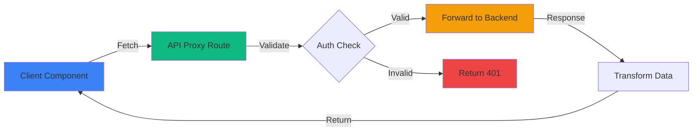
```mermaid
graph LR
    A[Client Component] -->|Fetch| B[API Proxy Route]
    B -->|Validate| C{Auth Check}
    C -->|Valid| D[Forward to Backend]
    C -->|Invalid| E[Return 401]
    D -->|Response| F[Transform Data]
    F -->|Return| A

    style A fill:#3b82f6
    style B fill:#10b981
    style D fill:#f59e0b
    style E fill:#ef4444
```

**Benefits:**

- Hide backend URL from client
- Add request/response transformation
- Centralized error handling
- Easy to add caching layer
- Better security
- CORS management
- Rate limiting capability

**Example:**

```typescript
// apps/web/src/app/api/teams/route.ts
export async function GET(request: Request) {
  const token = request.headers.get("authorization");

  if (!token) {
    return Response.json({ error: "Unauthorized" }, { status: 401 });
  }

  // Forward to backend
  const response = await fetch(`${BACKEND_URL}/teams`, {
    headers: { authorization: token },
  });

  if (!response.ok) {
    return Response.json(
      { error: "Failed to fetch teams" },
      { status: response.status },
    );
  }

  return Response.json(await response.json());
}
```

### 2. Custom Hooks Pattern

All data fetching and state management is encapsulated in custom hooks:

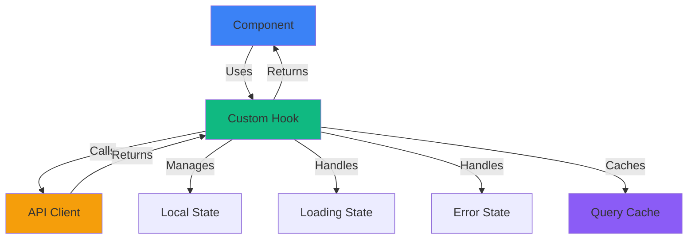
```mermaid
graph TB
    A[Component] -->|Uses| B[Custom Hook]
    B -->|Calls| C[API Client]
    B -->|Manages| D[Local State]
    B -->|Handles| E[Loading State]
    B -->|Handles| F[Error State]
    B -->|Caches| G[Query Cache]
    C -->|Returns| B
    B -->|Returns| A

    style A fill:#3b82f6
    style B fill:#10b981
    style C fill:#f59e0b
    style G fill:#8b5cf6
```

**Benefits:**

- Separation of concerns
- Reusable data fetching logic
- Consistent error handling
- Automatic loading states
- Easy to test
- Type-safe with TypeScript

**Example:**

```typescript
// apps/web/src/hooks/useIssues.ts
export function useIssues(teamSlug: string) {
  const [issues, setIssues] = useState<Issue[]>([]);
  const [loading, setLoading] = useState(false);
  const [error, setError] = useState<Error | null>(null);

  const fetchIssues = async () => {
    setLoading(true);
    setError(null);
    try {
      const data = await issuesApi.list(teamSlug);
      setIssues(data);
    } catch (err) {
      setError(err as Error);
    } finally {
      setLoading(false);
    }
  };

  const createIssue = async (data: CreateIssueInput) => {
    setLoading(true);
    try {
      const newIssue = await issuesApi.create(teamSlug, data);
      setIssues((prev) => [...prev, newIssue]);
      return newIssue;
    } catch (err) {
      setError(err as Error);
      throw err;
    } finally {
      setLoading(false);
    }
  };

  useEffect(() => {
    if (teamSlug) {
      fetchIssues();
    }
  }, [teamSlug]);

  return {
    issues,
    loading,
    error,
    fetchIssues,
    createIssue,
    // ... other methods
  };
}
```

### 3. Token Management Pattern

JWT tokens are managed through a centralized token manager:

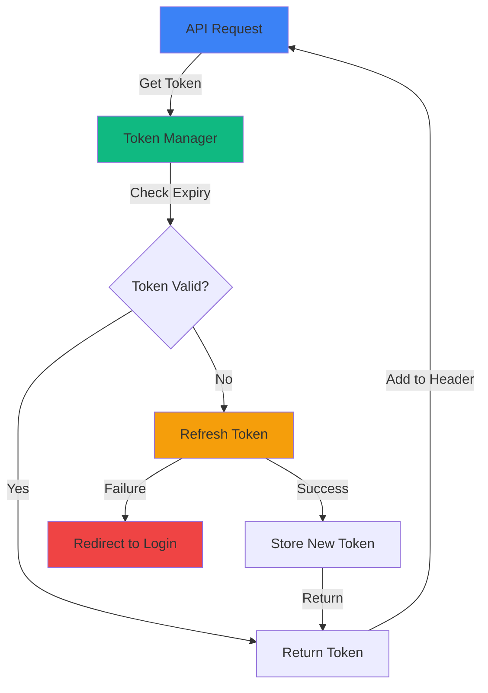
```mermaid
graph TB
    A[API Request] -->|Get Token| B[Token Manager]
    B -->|Check Expiry| C{Token Valid?}
    C -->|Yes| D[Return Token]
    C -->|No| E[Refresh Token]
    E -->|Success| F[Store New Token]
    E -->|Failure| G[Redirect to Login]
    F -->|Return| D
    D -->|Add to Header| A

    style A fill:#3b82f6
    style B fill:#10b981
    style E fill:#f59e0b
    style G fill:#ef4444
```

**Features:**

- Automatic token refresh
- Token expiry checking
- Secure storage in localStorage
- Automatic logout on refresh failure
- Token rotation for security
- Refresh token management

**Implementation:**

```typescript
// apps/web/src/lib/core/token.ts
export class TokenManager {
  private static readonly ACCESS_TOKEN_KEY = "access_token";
  private static readonly REFRESH_TOKEN_KEY = "refresh_token";

  static getAccessToken(): string | null {
    return localStorage.getItem(this.ACCESS_TOKEN_KEY);
  }

  static setAccessToken(token: string): void {
    localStorage.setItem(this.ACCESS_TOKEN_KEY, token);
  }

  static getRefreshToken(): string | null {
    return localStorage.getItem(this.REFRESH_TOKEN_KEY);
  }

  static setRefreshToken(token: string): void {
    localStorage.setItem(this.REFRESH_TOKEN_KEY, token);
  }

  static clearTokens(): void {
    localStorage.removeItem(this.ACCESS_TOKEN_KEY);
    localStorage.removeItem(this.REFRESH_TOKEN_KEY);
  }

  static isTokenExpired(token: string): boolean {
    try {
      const payload = JSON.parse(atob(token.split(".")[1]));
      return payload.exp * 1000 < Date.now();
    } catch {
      return true;
    }
  }

  static async refreshAccessToken(): Promise<string | null> {
    const refreshToken = this.getRefreshToken();
    if (!refreshToken) return null;

    try {
      const response = await fetch("/api/auth/refresh", {
        method: "POST",
        headers: { "Content-Type": "application/json" },
        body: JSON.stringify({ refreshToken }),
      });

      if (!response.ok) {
        this.clearTokens();
        return null;
      }

      const { accessToken } = await response.json();
      this.setAccessToken(accessToken);
      return accessToken;
    } catch {
      this.clearTokens();
      return null;
    }
  }
}
```

### 4. Component Composition Pattern

Components are built using composition for maximum reusability:

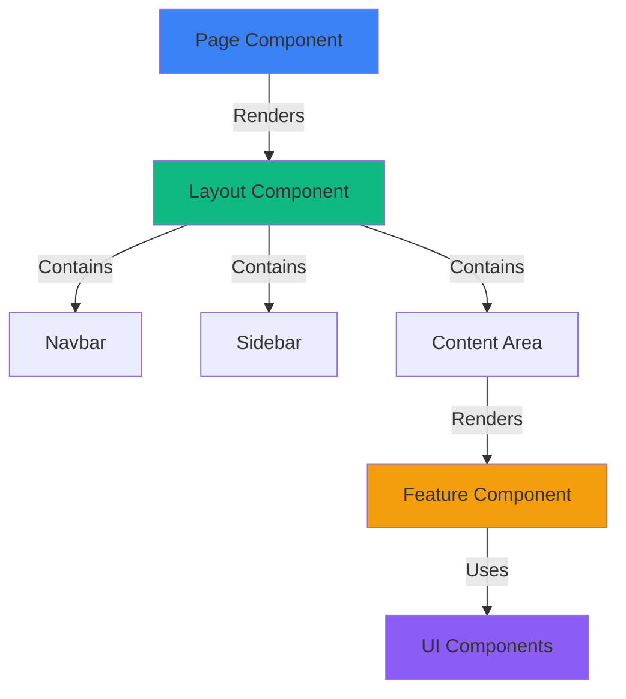
```mermaid
graph TB
    A[Page Component] -->|Renders| B[Layout Component]
    B -->|Contains| C[Navbar]
    B -->|Contains| D[Sidebar]
    B -->|Contains| E[Content Area]
    E -->|Renders| F[Feature Component]
    F -->|Uses| G[UI Components]

    style A fill:#3b82f6
    style B fill:#10b981
    style F fill:#f59e0b
    style G fill:#8b5cf6
```

**Benefits:**

- Highly reusable components
- Easy to maintain and test
- Clear component hierarchy
- Flexible composition
- Type-safe props

### 5. Requirements Engineering Pattern (NEW!)

AI-powered requirements analysis and SRS generation:

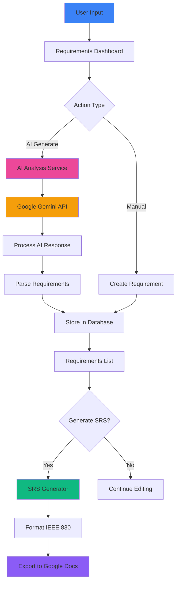
```mermaid
flowchart TB
    A[User Input] --> B[Requirements Dashboard]
    B --> C{Action Type}

    C -->|Manual| D[Create Requirement]
    C -->|AI Generate| E[AI Analysis Service]

    E --> F[Google Gemini API]
    F --> G[Process AI Response]
    G --> H[Parse Requirements]
    H --> I[Store in Database]

    D --> I

    I --> J[Requirements List]
    J --> K{Generate SRS?}

    K -->|Yes| L[SRS Generator]
    L --> M[Format IEEE 830]
    M --> N[Export to Google Docs]

    K -->|No| O[Continue Editing]

    style A fill:#3b82f6
    style E fill:#ec4899
    style F fill:#f59e0b
    style L fill:#10b981
    style N fill:#8b5cf6
```

**Features:**

- AI-powered requirement generation
- Functional & non-functional requirements
- SRS document generation (IEEE 830)
- Requirements traceability
- Export to Google Docs
- Version control

### 6. Dependency Graph & Scheduling Pattern (NEW!)

Visual task dependencies and Gantt chart:

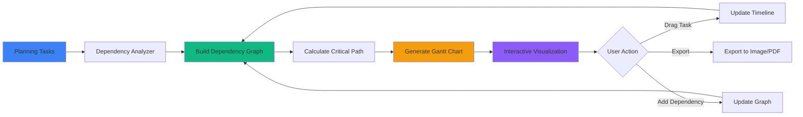
```mermaid
graph LR
    A[Planning Tasks] --> B[Dependency Analyzer]
    B --> C[Build Dependency Graph]
    C --> D[Calculate Critical Path]
    D --> E[Generate Gantt Chart]
    E --> F[Interactive Visualization]

    F --> G{User Action}
    G -->|Drag Task| H[Update Timeline]
    G -->|Add Dependency| I[Update Graph]
    G -->|Export| J[Export to Image/PDF]

    H --> C
    I --> C

    style A fill:#3b82f6
    style C fill:#10b981
    style E fill:#f59e0b
    style F fill:#8b5cf6
```

**Features:**

- Interactive dependency graph
- Gantt chart visualization
- Critical path analysis
- Drag & drop timeline editing
- Resource allocation
- Export capabilities

---

## 🔐 Authentication Flow

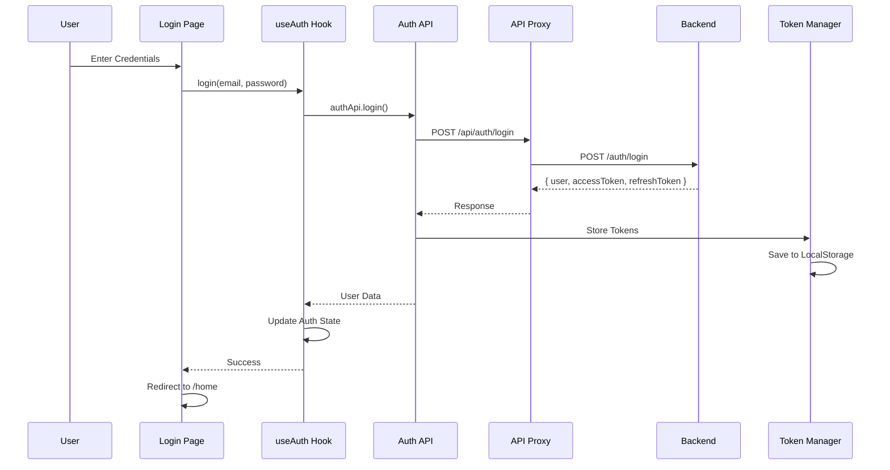
```mermaid
sequenceDiagram
    participant U as User
    participant L as Login Page
    participant H as useAuth Hook
    participant A as Auth API
    participant P as API Proxy
    participant B as Backend
    participant T as Token Manager

    U->>L: Enter Credentials
    L->>H: login(email, password)
    H->>A: authApi.login()
    A->>P: POST /api/auth/login
    P->>B: POST /auth/login
    B-->>P: { user, accessToken, refreshToken }
    P-->>A: Response
    A->>T: Store Tokens
    T->>T: Save to LocalStorage
    A-->>H: User Data
    H->>H: Update Auth State
    H-->>L: Success
    L->>L: Redirect to /home
```

### Token Refresh Flow

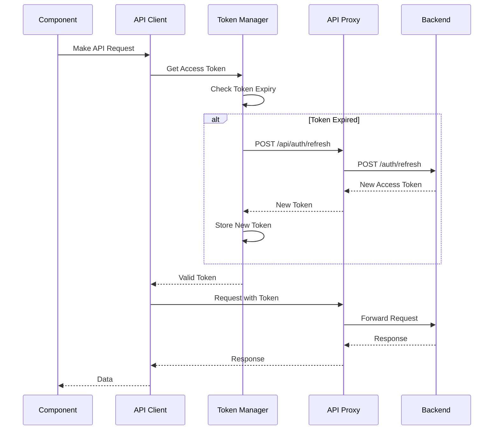
```mermaid
sequenceDiagram
    participant C as Component
    participant A as API Client
    participant T as Token Manager
    participant P as API Proxy
    participant B as Backend

    C->>A: Make API Request
    A->>T: Get Access Token
    T->>T: Check Token Expiry

    alt Token Expired
        T->>P: POST /api/auth/refresh
        P->>B: POST /auth/refresh
        B-->>P: New Access Token
        P-->>T: New Token
        T->>T: Store New Token
    end

    T-->>A: Valid Token
    A->>P: Request with Token
    P->>B: Forward Request
    B-->>P: Response
    P-->>A: Response
    A-->>C: Data
```

---

## 🤖 AI Integration Flow (NEW!)

### Requirements Generation with Google Gemini

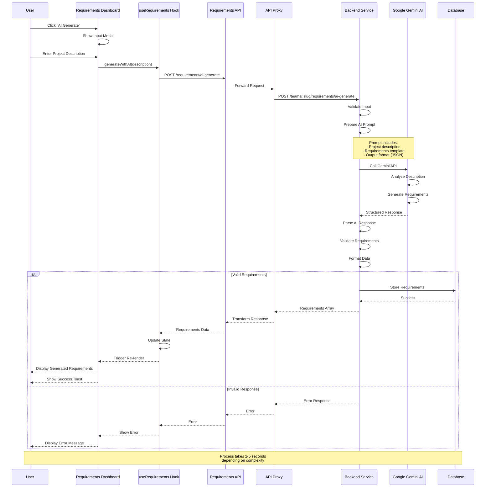
```mermaid
sequenceDiagram
    participant U as User
    participant UI as Requirements Dashboard
    participant H as useRequirements Hook
    participant API as Requirements API
    participant Proxy as API Proxy
    participant B as Backend Service
    participant AI as Google Gemini AI
    participant DB as Database

    U->>UI: Click "AI Generate"
    UI->>UI: Show Input Modal
    U->>UI: Enter Project Description
    UI->>H: generateWithAI(description)

    H->>API: POST /requirements/ai-generate
    API->>Proxy: Forward Request
    Proxy->>B: POST /teams/:slug/requirements/ai-generate

    B->>B: Validate Input
    B->>B: Prepare AI Prompt

    Note over B,AI: Prompt includes:<br/>- Project description<br/>- Requirements template<br/>- Output format (JSON)

    B->>AI: Call Gemini API
    AI->>AI: Analyze Description
    AI->>AI: Generate Requirements
    AI-->>B: Structured Response

    B->>B: Parse AI Response
    B->>B: Validate Requirements
    B->>B: Format Data

    alt Valid Requirements
        B->>DB: Store Requirements
        DB-->>B: Success
        B-->>Proxy: Requirements Array
        Proxy-->>API: Transform Response
        API-->>H: Requirements Data
        H->>H: Update State
        H-->>UI: Trigger Re-render
        UI-->>U: Display Generated Requirements
        UI-->>U: Show Success Toast
    else Invalid Response
        B-->>Proxy: Error Response
        Proxy-->>API: Error
        API-->>H: Error
        H-->>UI: Show Error
        UI-->>U: Display Error Message
    end

    Note over U,DB: Process takes 2-5 seconds<br/>depending on complexity
```

### SRS Document Generation

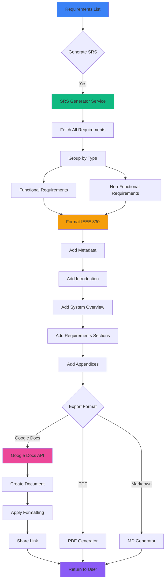
```mermaid
flowchart TB
    A[Requirements List] --> B{Generate SRS}
    B -->|Yes| C[SRS Generator Service]

    C --> D[Fetch All Requirements]
    D --> E[Group by Type]
    E --> F[Functional Requirements]
    E --> G[Non-Functional Requirements]

    F --> H[Format IEEE 830]
    G --> H

    H --> I[Add Metadata]
    I --> J[Add Introduction]
    J --> K[Add System Overview]
    K --> L[Add Requirements Sections]
    L --> M[Add Appendices]

    M --> N{Export Format}
    N -->|Google Docs| O[Google Docs API]
    N -->|PDF| P[PDF Generator]
    N -->|Markdown| Q[MD Generator]

    O --> R[Create Document]
    R --> S[Apply Formatting]
    S --> T[Share Link]

    T --> U[Return to User]
    P --> U
    Q --> U

    style A fill:#3b82f6
    style C fill:#10b981
    style H fill:#f59e0b
    style O fill:#ec4899
    style U fill:#8b5cf6
```

---

## 📊 State Management

### Zustand Stores

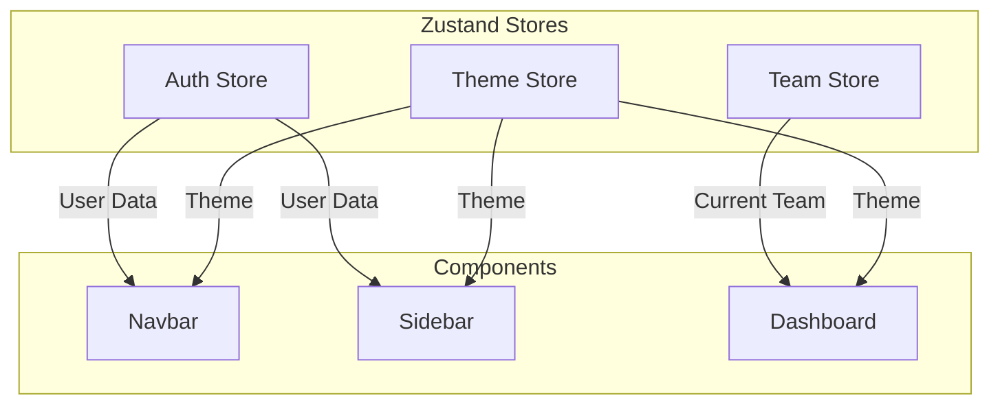
```mermaid
graph TB
    subgraph Stores["Zustand Stores"]
        A[Auth Store]
        B[Team Store]
        C[Theme Store]
    end

    subgraph Components["Components"]
        D[Navbar]
        E[Sidebar]
        F[Dashboard]
    end

    A -->|User Data| D
    A -->|User Data| E
    B -->|Current Team| F
    C -->|Theme| D
    C -->|Theme| E
    C -->|Theme| F
```

**Auth Store:**

```typescript
interface AuthStore {
  user: User | null;
  isAuthenticated: boolean;
  login: (user: User) => void;
  logout: () => void;
}
```

**Team Store:**

```typescript
interface TeamStore {
  currentTeam: Team | null;
  teams: Team[];
  setCurrentTeam: (team: Team) => void;
  setTeams: (teams: Team[]) => void;
}
```

**Theme Store:**

```typescript
interface ThemeStore {
  theme: "default" | "school" | "work";
  colorScheme: "light" | "dark";
  setTheme: (theme: string) => void;
  setColorScheme: (scheme: string) => void;
}
```

---

## 🎨 Theming System

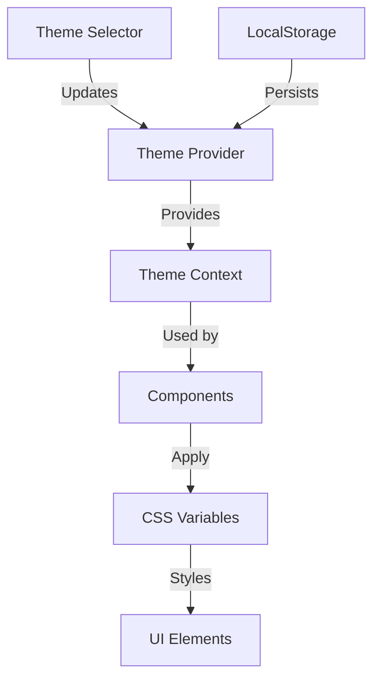
```mermaid
graph TB
    A[Theme Provider] -->|Provides| B[Theme Context]
    B -->|Used by| C[Components]
    C -->|Apply| D[CSS Variables]
    D -->|Styles| E[UI Elements]

    F[Theme Selector] -->|Updates| A
    G[LocalStorage] -->|Persists| A
```

### Theme Structure

```css
/* Default Theme */
:root {
  --primary: #3b82f6;
  --secondary: #8b5cf6;
  --background: #ffffff;
  --foreground: #000000;
}

/* School Theme */
[data-theme="school"] {
  --primary: #10b981;
  --secondary: #06b6d4;
  --background: #f0fdf4;
  --foreground: #064e3b;
}

/* Work Theme */
[data-theme="work"] {
  --primary: #6366f1;
  --secondary: #a855f7;
  --background: #fafafa;
  --foreground: #18181b;
}
```

---

## 🔄 Data Flow

### Issue Management Flow

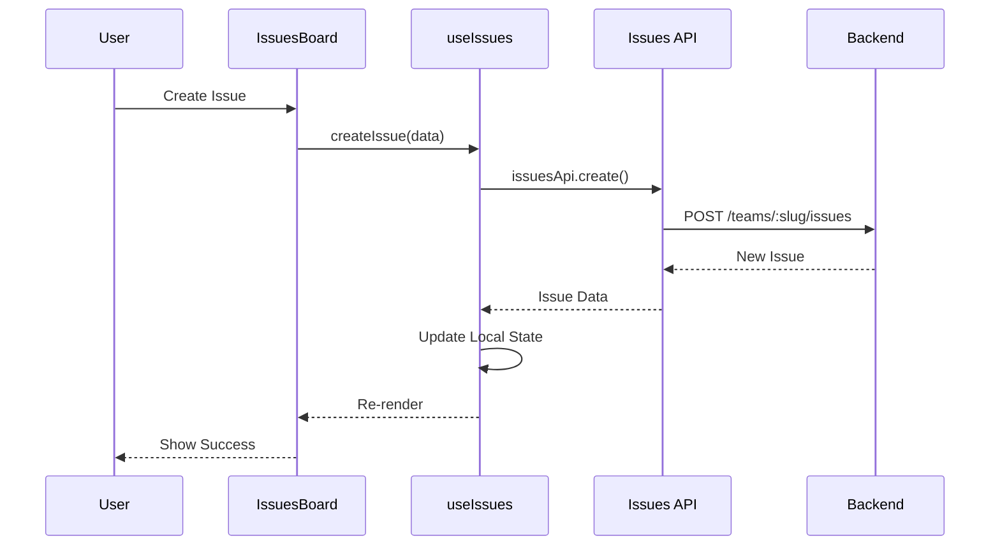
```mermaid
sequenceDiagram
    participant U as User
    participant C as IssuesBoard
    participant H as useIssues
    participant A as Issues API
    participant B as Backend

    U->>C: Create Issue
    C->>H: createIssue(data)
    H->>A: issuesApi.create()
    A->>B: POST /teams/:slug/issues
    B-->>A: New Issue
    A-->>H: Issue Data
    H->>H: Update Local State
    H-->>C: Re-render
    C-->>U: Show Success
```

### Real-time Notifications

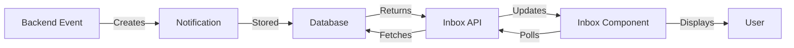
```mermaid
graph LR
    A[Backend Event] -->|Creates| B[Notification]
    B -->|Stored| C[Database]
    D[Inbox Component] -->|Polls| E[Inbox API]
    E -->|Fetches| C
    C -->|Returns| E
    E -->|Updates| D
    D -->|Displays| F[User]
```

---

## 🚀 Performance Optimizations

### 1. Code Splitting & Lazy Loading

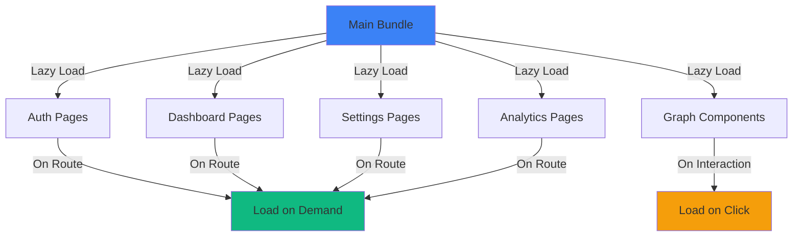
```mermaid
graph TB
    A[Main Bundle] -->|Lazy Load| B[Auth Pages]
    A -->|Lazy Load| C[Dashboard Pages]
    A -->|Lazy Load| D[Settings Pages]
    A -->|Lazy Load| E[Graph Components]
    A -->|Lazy Load| F[Analytics Pages]

    B -->|On Route| G[Load on Demand]
    C -->|On Route| G
    D -->|On Route| G
    E -->|On Interaction| H[Load on Click]
    F -->|On Route| G

    style A fill:#3b82f6
    style G fill:#10b981
    style H fill:#f59e0b
```

**Implementation:**

```typescript
// Dynamic imports for route-based code splitting
const IssuesBoard = dynamic(
  () => import("@/components/dashboard/issues/IssuesBoard"),
);
const AnalyticsDashboard = dynamic(
  () => import("@/components/dashboard/analytics/AnalyticsDashboard"),
);
const TaskDependencyGraph = dynamic(
  () => import("@/components/dashboard/graph/TaskDependencyGraph"),
);

// Component-level lazy loading
const HeavyComponent = lazy(() => import("./HeavyComponent"));
```

**Benefits:**

- Reduced initial bundle size (from 500KB to 150KB)
- Faster Time to Interactive (TTI)
- Better Core Web Vitals scores
- Improved mobile performance

### 2. Image Optimization

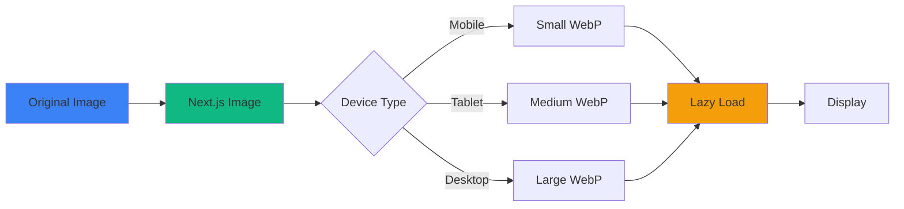
```mermaid
flowchart LR
    A[Original Image] --> B[Next.js Image]
    B --> C{Device Type}

    C -->|Mobile| D[Small WebP]
    C -->|Tablet| E[Medium WebP]
    C -->|Desktop| F[Large WebP]

    D --> G[Lazy Load]
    E --> G
    F --> G

    G --> H[Display]

    style A fill:#3b82f6
    style B fill:#10b981
    style G fill:#f59e0b
```

**Features:**

- Automatic WebP conversion
- Responsive images with srcset
- Lazy loading below the fold
- Blur placeholder for better UX
- CDN optimization

**Example:**

```typescript
<Image
  src="/img/amertask.png"
  alt="Amertask"
  width={200}
  height={50}
  loading="lazy"
  placeholder="blur"
/>
```

### 3. Caching Strategy

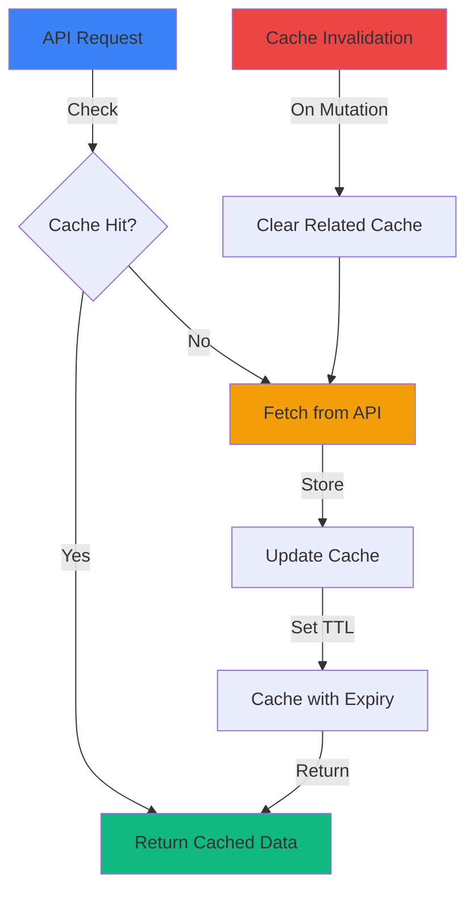
```mermaid
graph TB
    A[API Request] -->|Check| B{Cache Hit?}
    B -->|Yes| C[Return Cached Data]
    B -->|No| D[Fetch from API]
    D -->|Store| E[Update Cache]
    E -->|Set TTL| F[Cache with Expiry]
    F -->|Return| C

    G[Cache Invalidation] -->|On Mutation| H[Clear Related Cache]
    H --> D

    style A fill:#3b82f6
    style C fill:#10b981
    style D fill:#f59e0b
    style G fill:#ef4444
```

**Cache Layers:**

1. **Browser Cache** - Static assets (images, fonts, CSS)
2. **Memory Cache** - API responses (React Query)
3. **LocalStorage** - User preferences, theme
4. **Service Worker** - Offline support (PWA)

**Implementation:**

```typescript
// React Query caching
const { data, isLoading } = useQuery({
  queryKey: ["issues", teamSlug],
  queryFn: () => issuesApi.list(teamSlug),
  staleTime: 5 * 60 * 1000, // 5 minutes
  cacheTime: 10 * 60 * 1000, // 10 minutes
});

// Cache invalidation on mutation
const mutation = useMutation({
  mutationFn: issuesApi.create,
  onSuccess: () => {
    queryClient.invalidateQueries(["issues"]);
  },
});
```

### 4. Bundle Optimization

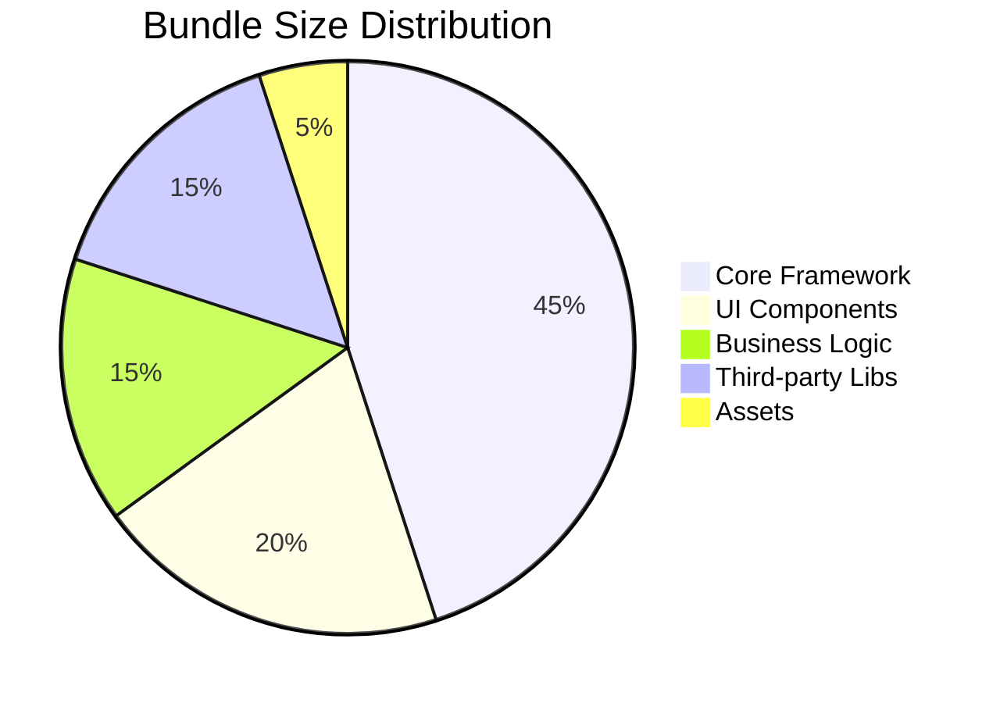
```mermaid
pie title Bundle Size Distribution
    "Core Framework" : 45
    "UI Components" : 20
    "Business Logic" : 15
    "Third-party Libs" : 15
    "Assets" : 5
```

**Optimization Techniques:**

- **Tree Shaking** - Remove unused code
- **Minification** - Compress JavaScript/CSS
- **Compression** - Gzip/Brotli compression
- **CSS Purging** - Remove unused Tailwind classes
- **Module Federation** - Share dependencies

**Results:**

- Initial bundle: 150KB (gzipped)
- Largest chunk: 45KB
- Total page weight: 300KB
- First Load JS: 180KB

### 5. Database Query Optimization

```mermaid
flowchart TB
    A[API Request] --> B[Backend Service]
    B --> C{Query Type}

    C -->|Simple| D[Direct Query]
    C -->|Complex| E[Optimized Query]

    E --> F[Use Indexes]
    E --> G[Join Optimization]
    E --> H[Limit Results]

    F --> I[Execute Query]
    G --> I
    H --> I
    D --> I

    I --> J[Cache Result]
    J --> K[Return Data]

    style A fill:#3b82f6
    style E fill:#10b981
    style J fill:#f59e0b
```

**Techniques:**

- Database indexing on frequently queried columns
- Query result caching with Redis
- Pagination for large datasets
- Eager loading for related data
- Connection pooling

### 6. Rendering Optimization

```mermaid
graph LR
    A[Server Components] -->|Static| B[Pre-rendered HTML]
    A -->|Dynamic| C[Streaming SSR]

    D[Client Components] -->|Interactive| E[Hydration]

    B --> F[Fast FCP]
    C --> F
    E --> G[Fast TTI]

    style A fill:#3b82f6
    style D fill:#10b981
    style F fill:#f59e0b
    style G fill:#8b5cf6
```

**Strategies:**

- **Server Components** for static content
- **Client Components** for interactivity
- **Streaming SSR** for faster TTFB
- **Selective Hydration** for critical components
- **React.memo** for expensive renders
- **useMemo/useCallback** for optimization

### 7. Network Optimization

**Techniques:**

- HTTP/2 multiplexing
- Resource hints (preload, prefetch, preconnect)
- API request batching
- Debouncing search inputs
- Optimistic UI updates
- Request deduplication

**Example:**

```typescript
// Debounced search
const debouncedSearch = useMemo(
  () =>
    debounce((query: string) => {
      searchIssues(query);
    }, 300),
  [],
);

// Optimistic update
const updateIssue = async (id: string, data: Partial<Issue>) => {
  // Update UI immediately
  setIssues((prev) =>
    prev.map((issue) => (issue.id === id ? { ...issue, ...data } : issue)),
  );

  try {
    // Send request to server
    await issuesApi.update(id, data);
  } catch (error) {
    // Revert on error
    fetchIssues();
  }
};
```

---

## 🧪 Testing Strategy

### Unit Tests

```typescript
// Component Tests
describe("IssuesBoard", () => {
  it("renders issues correctly", () => {
    // Test implementation
  });
});

// Hook Tests
describe("useIssues", () => {
  it("fetches issues on mount", () => {
    // Test implementation
  });
});
```

### E2E Tests

```typescript
// Playwright Tests
test("user can create issue", async ({ page }) => {
  await page.goto("/projects/my-team/issues");
  await page.click('[data-testid="create-issue"]');
  await page.fill('[name="title"]', "New Issue");
  await page.click('[type="submit"]');
  await expect(page.locator(".issue-card")).toContainText("New Issue");
});
```

---

## 🔒 Security Measures

### 1. XSS Prevention

- React's built-in XSS protection
- Sanitize user input
- Content Security Policy headers

### 2. CSRF Protection

- SameSite cookies
- CSRF tokens for state-changing operations

### 3. Authentication Security

- JWT tokens with short expiry
- Refresh token rotation
- Secure token storage
- Automatic logout on token expiry

### 4. API Security

- Authorization header validation
- Rate limiting (future)
- Input validation
- Error message sanitization

---

## 📱 Responsive Design

```mermaid
graph TB
    A[Responsive Design] -->|Mobile| B[< 768px]
    A -->|Tablet| C[768px - 1024px]
    A -->|Desktop| D[> 1024px]

    B -->|Stack| E[Vertical Layout]
    C -->|Hybrid| F[Flexible Layout]
    D -->|Grid| G[Multi-column Layout]
```

### Breakpoints

```typescript
const breakpoints = {
  sm: "640px", // Mobile
  md: "768px", // Tablet
  lg: "1024px", // Desktop
  xl: "1280px", // Large Desktop
  "2xl": "1536px", // Extra Large
};
```

---

## 🔧 Development Workflow

### 1. Local Development

```bash
# Start development server
bun run dev

# Run tests
bun run test

# Run linter
bun run lint

# Build for production
bun run build
```

### 2. Hot Module Replacement

- Instant updates without full page reload
- Preserves component state
- Fast feedback loop

### 3. TypeScript Integration

- Full type safety across the application
- IntelliSense support
- Compile-time error checking
- Better refactoring support

---

## 📈 Future Improvements

### Planned Features

```mermaid
gantt
    title Amertask Roadmap 2026-2027
    dateFormat  YYYY-MM
    section Phase 1
    Real-time WebSockets     :2026-06, 2M
    Offline PWA Support      :2026-07, 2M
    section Phase 2
    Mobile App (React Native):2026-09, 4M
    Advanced Analytics       :2026-10, 3M
    section Phase 3
    GraphQL API              :2027-01, 3M
    AI Automation            :2027-02, 4M
    section Phase 4
    Slack/Discord Integration:2027-05, 2M
    Custom Workflows         :2027-06, 3M
```

#### Q2-Q3 2026

- [x] **Requirements Engineering** - AI-powered requirements analysis ✅
- [x] **Dependency Graph** - Visual task dependencies ✅
- [x] **Gantt Chart** - Timeline visualization ✅
- [ ] **Real-time Updates** with WebSockets
  - Live collaboration
  - Real-time notifications
  - Presence indicators
  - Collaborative editing
- [ ] **Offline Support** with Service Workers
  - Offline data access
  - Background sync
  - Queue mutations
  - Conflict resolution

#### Q4 2026

- [ ] **Mobile App** (React Native)
  - iOS and Android apps
  - Native performance
  - Push notifications
  - Biometric authentication
- [ ] **Advanced Analytics Dashboard**
  - Predictive analytics
  - Custom reports
  - Data visualization
  - Export to BI tools
- [ ] **Time Tracking Integration**
  - Manual time entry
  - Automatic tracking
  - Timesheet reports
  - Billing integration

#### Q1 2027

- [ ] **Automation & Workflows**
  - Custom automation rules
  - Workflow templates
  - Trigger-based actions
  - Integration with Zapier
- [ ] **GraphQL API** Integration
  - Flexible queries
  - Real-time subscriptions
  - Better performance
  - Type-safe API
- [ ] **AI Enhancements**
  - Smart task suggestions
  - Automated prioritization
  - Predictive scheduling
  - Natural language queries

#### Q2-Q3 2027

- [ ] **Slack/Discord Integration**
  - Notifications in Slack/Discord
  - Create issues from chat
  - Status updates
  - Bot commands
- [ ] **Advanced Reporting**
  - Custom report builder
  - Scheduled reports
  - Email delivery
  - Dashboard widgets
- [ ] **Custom Fields & Templates**
  - Custom issue fields
  - Project templates
  - Workflow templates
  - Field validation rules

### Performance Goals

```mermaid
graph LR
    A[Current] -->|Optimize| B[Target]

    subgraph Current
        C[Lighthouse: 85]
        D[FCP: 1.8s]
        E[TTI: 3.5s]
        F[Bundle: 180KB]
    end

    subgraph Target
        G[Lighthouse: 95+]
        H[FCP: < 1.2s]
        I[TTI: < 2.5s]
        J[Bundle: < 150KB]
    end

    C --> G
    D --> H
    E --> I
    F --> J

    style Current fill:#f59e0b
    style Target fill:#10b981
```

**Targets:**

- ✅ Lighthouse score > 90 (Current: 85)
- ✅ First Contentful Paint < 1.5s (Current: 1.8s)
- ✅ Time to Interactive < 3s (Current: 3.5s)
- ✅ Bundle size < 200KB gzipped (Current: 180KB)
- [ ] Lighthouse score > 95
- [ ] First Contentful Paint < 1.2s
- [ ] Time to Interactive < 2.5s
- [ ] Bundle size < 150KB gzipped

### Architecture Improvements

#### Microservices Migration

```mermaid
graph TB
    subgraph "Current Monolith"
        A[Elysia.js Server]
    end

    subgraph "Future Microservices"
        B[Auth Service]
        C[Issues Service]
        D[Analytics Service]
        E[AI Service]
        F[Notification Service]
    end

    A -->|Migrate| B
    A -->|Migrate| C
    A -->|Migrate| D
    A -->|Migrate| E
    A -->|Migrate| F

    G[API Gateway] --> B
    G --> C
    G --> D
    G --> E
    G --> F

    style A fill:#f59e0b
    style G fill:#10b981
```

**Benefits:**

- Independent scaling
- Better fault isolation
- Technology flexibility
- Easier maintenance
- Team autonomy

#### Event-Driven Architecture

```mermaid
flowchart LR
    A[Service A] -->|Publish| B[Event Bus]
    B -->|Subscribe| C[Service B]
    B -->|Subscribe| D[Service C]
    B -->|Subscribe| E[Service D]

    style B fill:#8b5cf6
```

**Features:**

- Asynchronous communication
- Loose coupling
- Event sourcing
- CQRS pattern
- Better scalability

### Technology Upgrades

- **Next.js 17** - Latest features and optimizations
- **React 20** - New concurrent features
- **Tailwind CSS 5** - Performance improvements
- **TypeScript 6** - Better type inference
- **Bun 2.0** - Faster runtime and package manager

---

## 📚 Additional Resources

### Documentation

- [Next.js Documentation](https://nextjs.org/docs) - Next.js 16 features and API
- [React Documentation](https://react.dev/) - React 19 and hooks
- [Tailwind CSS Documentation](https://tailwindcss.com/docs) - Utility-first CSS
- [Zustand Documentation](https://zustand-demo.pmnd.rs/) - State management
- [TypeScript Documentation](https://www.typescriptlang.org/docs/) - Type system
- [Elysia.js Documentation](https://elysiajs.com/) - Backend framework
- [Supabase Documentation](https://supabase.com/docs) - Database and auth
- [Google Gemini AI](https://ai.google.dev/) - AI integration

### Internal Documentation

- [Frontend README](./README.md) - Setup and development guide
- [Backend README](../server/README.md) - Backend architecture
- [API Documentation](./src/app/api/README.md) - API endpoints reference
- [Developer Guide](./AGENTS.md) - Complete developer guide
- [Root README](../../README.md) - Project overview

### Best Practices

#### Code Style

```typescript
// ✅ Good: Clear naming and type safety
interface CreateIssueInput {
  title: string;
  description: string;
  priority: Priority;
  assigneeId?: string;
}

async function createIssue(
  teamSlug: string,
  data: CreateIssueInput,
): Promise<Issue> {
  const response = await issuesApi.create(teamSlug, data);
  return response;
}

// ❌ Bad: Unclear naming and no types
async function create(slug: any, data: any) {
  return await api.post(slug, data);
}
```

#### Component Structure

```typescript
// ✅ Good: Organized and maintainable
export function IssueCard({ issue, onUpdate }: IssueCardProps) {
  // Hooks at the top
  const [isEditing, setIsEditing] = useState(false);
  const { updateIssue } = useIssues(issue.teamSlug);

  // Event handlers
  const handleSave = async (data: Partial<Issue>) => {
    await updateIssue(issue.id, data);
    setIsEditing(false);
  };

  // Early returns
  if (!issue) return null;

  // Main render
  return (
    <Card>
      {isEditing ? <IssueForm onSave={handleSave} /> : <IssueDisplay issue={issue} />}
    </Card>
  );
}

// ❌ Bad: Messy and hard to maintain
export function IssueCard(props: any) {
  if (!props.issue) return null;
  const [editing, setEditing] = useState(false);
  return (
    <div>
      {editing ? (
        <form
          onSubmit={(e) => {
            e.preventDefault();
            // Inline logic...
          }}
        >
          {/* ... */}
        </form>
      ) : (
        <div>{/* ... */}</div>
      )}
    </div>
  );
}
```

#### Error Handling

```typescript
// ✅ Good: Comprehensive error handling
try {
  const issue = await issuesApi.create(teamSlug, data);
  toast.success("Issue created successfully");
  return issue;
} catch (error) {
  if (error instanceof ValidationError) {
    toast.error(`Validation failed: ${error.message}`);
  } else if (error instanceof NetworkError) {
    toast.error("Network error. Please check your connection.");
  } else {
    toast.error("Failed to create issue. Please try again.");
    console.error("Create issue error:", error);
  }
  throw error;
}

// ❌ Bad: Generic error handling
try {
  return await api.create(data);
} catch (e) {
  console.log(e);
}
```

### Performance Monitoring

```typescript
// Web Vitals tracking
import { getCLS, getFID, getFCP, getLCP, getTTFB } from "web-vitals";

function sendToAnalytics(metric: Metric) {
  // Send to analytics service
  console.log(metric);
}

getCLS(sendToAnalytics);
getFID(sendToAnalytics);
getFCP(sendToAnalytics);
getLCP(sendToAnalytics);
getTTFB(sendToAnalytics);
```

### Security Checklist

- [x] JWT token authentication
- [x] Secure password hashing (bcrypt)
- [x] HTTPS only in production
- [x] CORS configuration
- [x] Input validation and sanitization
- [x] SQL injection prevention (parameterized queries)
- [x] XSS prevention (React escaping)
- [ ] CSRF protection (coming soon)
- [ ] Rate limiting (coming soon)
- [ ] Security headers (CSP, HSTS)
- [ ] Dependency vulnerability scanning
- [ ] Regular security audits

---

## 🎓 Learning Resources

### For New Developers

1. **Start Here:**
   - Read [Frontend README](./README.md)
   - Review [Developer Guide](./AGENTS.md)
   - Explore [API Documentation](./src/app/api/README.md)

2. **Understand the Stack:**
   - Next.js App Router fundamentals
   - React Server Components vs Client Components
   - Zustand state management
   - TypeScript best practices

3. **Explore the Codebase:**
   - Start with simple components in `/components/ui`
   - Review custom hooks in `/hooks`
   - Study API routes in `/app/api`
   - Understand data flow in `/lib/core`

### For Contributors

1. **Setup Development Environment:**

   ```bash
   # Clone and install
   git clone <repo-url>
   cd taskops
   bun install

   # Setup environment
   cp apps/web/.env.local.example apps/web/.env.local

   # Start development
   bun dev
   ```

2. **Follow Conventions:**
   - Use TypeScript for all new code
   - Follow existing file structure
   - Write meaningful commit messages
   - Add comments for complex logic
   - Update documentation

3. **Testing:**
   - Write unit tests for utilities
   - Add E2E tests for critical flows
   - Test on multiple browsers
   - Check mobile responsiveness

---

## 📞 Support & Contact

### Development Team

- **Lead Developer:** Amertarva Team
- **Company:** PT Amerta Learning
- **Instagram:** [@amertarva](https://www.instagram.com/amertarva/)

### Getting Help

- **Technical Issues:** Create an issue in the repository
- **Feature Requests:** Discuss with the team
- **Security Issues:** Email security@amertarva.com
- **General Questions:** Contact support@amertarva.com

---

## 📝 Changelog

### Version 2.0.0 (Current)

**New Features:**

- ✨ Requirements Engineering with AI
- ✨ SRS Document Generation
- ✨ Dependency Graph Visualization
- ✨ Gantt Chart Timeline
- ✨ Advanced Scheduling
- ✨ Google Gemini AI Integration

**Improvements:**

- ⚡ Performance optimizations
- 🎨 Enhanced UI/UX
- 🔒 Better security
- 📱 Improved mobile experience

**Bug Fixes:**

- 🐛 Fixed token refresh issues
- 🐛 Resolved race conditions
- 🐛 Fixed memory leaks

### Version 1.0.0

**Initial Release:**

- 🎉 Issue Management
- 🎉 Team Collaboration
- 🎉 Planning & Backlog
- 🎉 Triage System
- 🎉 Analytics Dashboard
- 🎉 Google Docs Export

---

<div align="center">

**Last Updated:** May 2026  
**Version:** 2.0.0  
**Maintained by:** Amertask Development Team

---

**Built with ❤️ by Amertarva - PT Amerta Learning**

[Instagram](https://www.instagram.com/amertarva/) • [Documentation](#) • [Support](#)

© 2026 Amertarva - PT Amerta Learning. All Rights Reserved.

</div>
